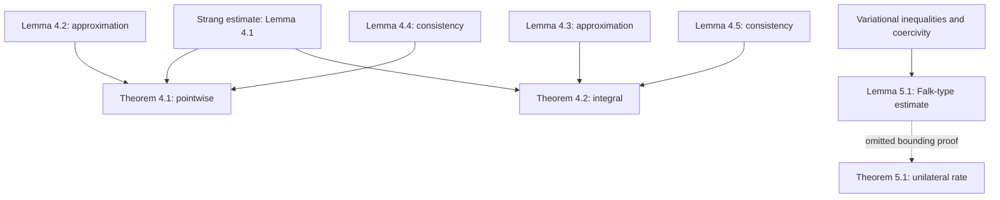

## 1. Paper identity and reading scope

F. B. Belgacem, P. Hild, and P. Laborde, *The mortar finite element method for contact problems*, **Mathematical and Computer Modelling 28** (1998), 263–271. [DOI](https://doi.org/10.1016/S0895-7177(98)00121-6) · [Zotero item](zotero://select/library/items/G3NNTARZ) · [PDF](zotero://open-pdf/library/items/2K5ADFUR).

Read all nine existing PDF pages, including references. Printed page = PDF page + 262. Title and authors match the library item. The rendered printed p. 268 was inspected to verify the different convergence exponents. Some proofs are explicitly deferred by the authors; complete reading does **not** mean their omitted proofs have been verified. No external sources or additional PDFs were used.

## 2. Main contribution in plain language

The paper explains how **two elastic bodies can have independently generated meshes and still satisfy a meaningful contact coupling**. Its central distinction is between matching normal displacement at selected nodes and matching it through interface integrals. The integral, or mortar, condition preserves the optimal approximation order for *bilateral* contact; the paper then adapts this construction to *unilateral* contact with possible separation.

The important qualification is that the strong optimality result belongs to the bilateral problem. For unilateral contact the authors announce convergence with a much weaker bound and explicitly leave technical proofs and improvement to later work (§§1, 4.3, 5.3). Do not read the title as a proof of optimal unilateral mortar convergence.

## 3. Main results and their scope

For two-dimensional, small-strain, frictionless linear elasticity, with positive-measure clamped boundaries, positive-definite elastic tensors, polygonal bodies, regular finite-element meshes, and suitable interface mesh regularity:

- **Well-posedness:** the continuous and discrete bilateral problems have unique solutions by the imported Lax–Milgram theorem; the unilateral problems have unique solutions by the imported Stampacchia theorem (§§2–3, 5–5.1).
- **Bilateral pointwise matching, Theorem 4.1 (p. 268):** for degree-$q$ elements and $u^\ell\in H^{q+1}(\Omega^\ell)^2$,
  $$\|u-u_h\|_*\le C(u)(h_1^{1/2}+h_2^q).$$
  The estimate assumes the chosen interface side is side 1 and $h_1/h_2$ is bounded. Even high-order elements do not improve the displayed $h_1^{1/2}$ consistency bound.
- **Bilateral integral matching, Theorem 4.2 (p. 268):**
  $$\|u-u_h\|_*\le C\bigl(h_1^q\|u^1\|_{H^{q+1}(\Omega^1)}+h_2^q\|u^2\|_{H^{q+1}(\Omega^2)}\bigr).$$
  Here $\|\cdot\|_*$ is the product $H^1$ norm: displacement and its first derivatives in both bodies. “Optimal” means the usual degree-$q$ energy-error order is preserved by coupling; it does not mean an optimal linear solver or exact pointwise continuity.
- **Unilateral matching, Theorem 5.1 (p. 271):** for piecewise linear elements, $u^\ell\in H^2(\Omega^\ell)^2$, and bounded $h_1/h_2$, both couplings satisfy the stated bound
  $$\|u-u_h\|_*\le C(u)(h_1^{1/4}+h_2).$$
  The final rate is **stated without its technical proof**. On comparable meshes this only guarantees $O(h^{1/4})$. It does not demonstrate that actual numerical errors decay this slowly.

Constants are independent of mesh size under the stated regularity assumptions, not universally independent of geometry, material, or solution smoothness. None of these results cover friction, finite deformation, or iterative-solver convergence.

## 4. Method and mathematical setup

The unknown $u=(u^1,u^2)$ contains the displacement in each body. Strain is $\varepsilon(u)=\tfrac12(\nabla u+\nabla u^T)$ and stress is $\sigma^\ell=A^\ell\varepsilon(u^\ell)$. The elastic bilinear form is

$$a(u,v)=\sum_{\ell=1}^2\int_{\Omega^\ell}A^\ell\varepsilon(u^\ell):\varepsilon(v^\ell).$$

Let $[v_n]=v^1\cdot n^1+v^2\cdot n^2$ be the relative normal displacement using each body's outward normal. Bilateral contact imposes $[u_n]=0$: separation is prohibited as well as penetration. Unilateral contact instead imposes (§5, equations (9)–(11))

$$[u_n]\le0,\qquad \sigma_N(u)\le0,\qquad \sigma_N(u)[u_n]=0.$$

With this convention negative normal jump allows opening; negative normal stress is compression. Complementarity says an open interface carries no contact pressure, while a compressed interface cannot open.

For bilateral contact the exact space $V$ contains continuous normal traces, and $a(u,v)=L(v)$. Independent meshes generally cannot satisfy that constraint exactly. The paper introduces two discrete spaces (§3): $V_h^p$ imposes equality at one side's nodes; $V_h^i$ imposes

$$\int_{\Gamma_c}[v_{h,n}]q_h=0\quad\text{for all }q_h\in M_h(\Gamma_c).$$

The mortar test space uses degree $q$ on interior interface segments, with degree reduced to $q-1$ on end segments. This detail is part of the construction, not an arbitrary implementation choice. Integral matching means the jump is invisible to a selected family of interface tests; it need not vanish everywhere.

For unilateral contact these linear spaces become convex sets $K_h^p,K_h^i$, with nodal inequalities or integral inequalities against nonnegative mortar functions. A convex set allows averaging admissible displacements while keeping them admissible. The discrete equilibrium is a variational inequality, not simply the bilateral linear equation with a different right-hand side (§5.1).

## 5. Analysis: what the authors are trying to prove

The authors want to establish that independently meshed bodies converge to the correctly coupled elastic solution. The main obstacle is **nonconformity**: a discrete admissible displacement can fail the exact contact condition between nodes or in interface modes not tested by the mortar space.

For bilateral contact the proof separates two questions: can the discrete space approximate the exact displacement, and how much artificial interface work does its remaining jump produce? For unilateral contact there is an additional difficulty: the admissible sets differ, and pressure times an approximate gap enters the error estimate.

| Result (paper label and locator) | Plain-language meaning | Assumptions and earlier results used | Why this step is needed | Where it is used next |
|---|---|---|---|---|
| Coercivity and Lax–Milgram (§2 p. 265; §3 p. 266) | Elastic energy controls displacement; equations have one solution | Tensor positivity (6), Korn inequality, clamped boundary, continuity | Excludes uncontrolled rigid motions and defines exact/discrete solutions | Lemma 4.1 and bilateral estimates |
| Lemma 4.1, p. 267 | Error is bounded by best approximation plus interface consistency error | Imported second Strang lemma, coercivity, interface traction identity | Makes the coupling defect measurable separately | Theorems 4.1 and 4.2 |
| Lemma 4.2, p. 267 | Pointwise matching still admits a good approximant | $H^{q+1}$ regularity; mesh assumptions; proof not supplied here | Shows approximation itself is not the main source of order loss | Theorem 4.1 |
| Lemma 4.3, p. 267 | Integral matching also admits an optimal approximant | Same smoothness; mortar construction; proof not supplied here | Supplies the approximation half of the mortar estimate | Theorem 4.2 |
| Lemma 4.4, p. 267 | Pointwise coupling leaves an interface work error bounded only by $h_1^{1/2}$ | Smooth solution, selected side and bounded mesh ratio; statement only | Identifies the limiting consistency bound | Theorem 4.1 |
| Lemma 4.5, p. 268 | Integral matching reduces interface work error to $O(h_1^q)$ | Orthogonality to $M_h$, imported mortar approximation estimate, dual Cauchy–Schwarz, trace theorem | Prevents coupling from losing the finite-element order | Theorem 4.2 |
| Theorems 4.1 and 4.2, p. 268 | Combine the two error contributions | Lemma 4.1 plus 4.2/4.4 or 4.3/4.5, respectively | Converts component estimates into displacement convergence | Bilateral conclusion |
| Stampacchia theorem applications (§5–5.1 p. 269) | The inequality problems have unique solutions | Closed convex admissible sets and coercive elasticity | Provides a meaningful unilateral exact/discrete pair | Lemma 5.1 |
| Lemma 5.1, pp. 270–271 | A Falk-type estimate splits unilateral error into approximation and consistency terms | Coercivity, both variational inequalities, Green's formula, complementarity, Young's inequality | Replaces the equation-specific Strang argument | Theorem 5.1, but final bounding steps omitted |
| Theorem 5.1, p. 271 | Both unilateral constructions converge with the announced $h_1^{1/4}+h_2$ bound | $H^2$ regularity, linear elements, bounded mesh ratio | Final unilateral conclusion | No later theorem; proof deferred |

The most educational proof is Lemma 4.5. The troublesome term is $\int\sigma_N(u)[w_{h,n}]$. Since the discrete jump integrates to zero against every $q_h\in M_h$, the same term equals $\int(\sigma_N(u)-q_h)[w_{h,n}]$. Now only the error in approximating the traction remains. The negative $H^{-1/2}$ norm measures that traction by the work it performs against boundary displacement; it is paired with the trace's $H^{1/2}$ norm. A trace theorem controls boundary displacement by bulk $H^1$ displacement. These steps turn interface nonmatching into a small, quantified residual. Without integral orthogonality, the subtraction trick does not give this optimal bound.

Lemma 5.1 follows a different chain: compare the exact and discrete variational inequalities, use elastic coercivity to dominate the squared error, integrate by parts to expose interface work, and use complementarity to remove exact pressure-gap products. One term asks how well $u$ can be approximated inside $K_h$; another asks how far $u_h$ lies from the exact set $K$. That is the conceptual reason unilateral contact is harder. The paper does not give enough intermediate estimates to reconstruct its final quarter-order bound rigorously; the graph's dashed edge explicitly records that gap.

## 6. Experiments and supporting evidence

No numerical experiments, benchmark tables, or computed convergence plots are presented. Evidence is the formulation and mathematical estimates, with a detailed proof of Lemma 4.5 and of the abstract unilateral Lemma 5.1. Several auxiliary estimates and the final unilateral proof are stated or deferred (§1 p. 264; §5.3 p. 271).

Consequently this article does not establish empirical runtime, robustness on distorted meshes, contact-pressure quality, or the observed sharpness of $h^{1/4}$. Those questions require other evidence.

## 7. Reviewer’s reflections: value, strengths, and limitations

**Reviewer judgement.** This is an especially useful short paper for learning *why weak interface matching can outperform nodal matching*: the two bilateral proof paths isolate approximation and consistency with very little surrounding machinery (Lemmas 4.1–4.5). The same elastic physics underlies both, so the comparison genuinely illuminates the coupling choice.

Its unilateral extension is valuable as a conceptual bridge from nonconforming finite elements to variational inequalities. However, the authors themselves acknowledge the weak rate and deferred proof (§5.3). For a thesis proof or implementation guarantee, cite exactly the announced assumptions and do not present its unilateral analysis as fully developed in this article.

A practical limitation of the paper's scope is that it supplies neither an implementable nonlinear solution algorithm nor experiments. That does not invalidate the analysis; it means this is better used to understand consistency and constraint spaces than as a standalone contact-solver manual. The smoothness assumptions also need checking in applications with contact-edge singularities. This last point is a reviewer-inferred applicability concern, not a defect demonstrated by the article.

## 8. Takeaways, questions, and connections

- Nonmatching meshes create a consistency error even when each body has an excellent finite-element approximation.
- Mortar orthogonality lets a traction approximant cancel from that error; Lemma 4.5 is the key idea to learn.
- Bilateral optimality and unilateral convergence are different results with substantially different evidence here.
- The unilateral $h^{1/4}$ estimate is an upper bound on the error: it guarantees at least that rate under the stated assumptions and does not rule out faster convergence.

For a second reading: Why does reducing the mortar degree on endpoint segments matter? Can you identify the interface work term that vanishes for a conforming admissible set? Which omitted estimate must improve to obtain a better unilateral rate?

| Source | Relation | Target | Evidence locator | Status |
|---|---|---|---|---|
| This paper | uses | Second Strang lemma | Lemma 4.1 | Explicit |
| This paper | extends | Falk-type variational-inequality error estimate to nonconforming contact sets | Lemma 5.1 | Explicit |
| Integral matching | controls | Interface consistency error | Lemma 4.5 | Proved here |
| Unilateral mortar formulation | discretizes | Frictionless two-body Signorini contact | §5 | Explicit |

[Back to the contact mechanics reading map](Contact%20Mechanics%20-%20Review%20Index.md)

## Discussions

- [Nodal versus integral contact constraints](Discussions/Belgacem%20et%20al.%20%281998%29/Nodal%20versus%20integral%20contact%20constraints.md) — 2026-09-07. Constraint tests, quadrature, and traction approximation; fractional Sobolev spaces are the next topic.
