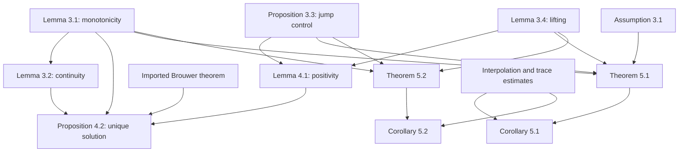

## 1. Paper identity and reading scope

Erik Burman, Peter Hansbo, Mats G. Larson, *Augmented Lagrangian finite element methods for contact problems* (2016 preprint). [Source identifier](https://arxiv.org/abs/1609.03326) · [Zotero](zotero://select/library/items/ZAV78EWP) · [PDF](zotero://open-pdf/library/items/DTMQF7ME).

Read all 26 existing PDF pages: §§1–6, references, and the final figure pages. PDF and printed page numbers coincide. The title/authors and arXiv v1 stamp match the library record. No publication-version substitution or external download was made. The rendered p. 16 was checked because its formulas and approximation argument raise transcription/notation issues; the review reports the theorem-level result while distinguishing these issues from independent proof verification.

## 2. Main contribution in plain language

The paper develops **two augmented-Lagrangian contact discretizations that keep a reaction-force multiplier, including a stabilized low-order choice with piecewise constant multipliers**. Penalizing jumps of that multiplier supplies control that the unstable displacement–multiplier pair otherwise lacks (§2).

The useful idea is to replace inequality constraints by a positive-part equation while preserving a consistent contact model. The authors analyze both boundary contact (Signorini) and contact throughout the domain (obstacle problem) in one framework. Their claimed contribution is not merely another penalty term: it is a stability and approximation analysis of these particular multiplier formulations, including discontinuous multipliers.

## 3. Main results and their scope

The models are scalar membrane problems on fitted, quasiuniform simplicial meshes of a bounded polygon/polyhedron in two or three dimensions, with homogeneous displacement constraints. They are **not** vector finite-deformation, frictional two-body contact models (§§1–2).

**Existence and uniqueness:** Proposition 4.2 proves that the discrete nonlinear system has exactly one solution under Lemma 4.1's parameter conditions. This is a statement about the system, not a guarantee that Newton iteration converges from any starting point.

**Best-approximation estimates:** Theorems 5.1 and 5.2 bound the displacement error, a mesh-weighted multiplier error, and a contact residual by approximation errors in the chosen finite-element spaces. A compact representation of their shared approximation side is

$$\|u-v_h\|_{H^1(\Omega)}^2+\gamma\|\lambda-\mu_h\|_C^2+\gamma^{-1}\|u-v_h\|_C^2+s(\mu_h,\mu_h).$$

The theorems include coercivity factors and method-specific residuals; this expression describes their structure, not an exact replacement for every coefficient. Here $\|\cdot\|_C$ is an $L^2$ norm on the potential contact region, and $s(\cdot,\cdot)$ is jump stabilization.

The scale is $\gamma=\gamma_0h^{2s}$ with $s=1/2$ for boundary contact and $s=1$ for the obstacle problem. Thus the analysis uses $\gamma\sim h$ and $\gamma\sim h^2$, respectively. **Formulation 1's error theorem requires sufficiently small $\gamma_0$ and sufficiently large stabilization parameter $\delta$; formulation 2 uses sufficiently large $\gamma_0$.** For its lowest-order case the proof also imposes a relationship involving $\delta$; the p. 18 absorption condition is $C(\delta+1)/\gamma_0\le\alpha/2$, and Lemma 4.1 states its own sufficient restriction. These qualifiers should accompany any use of the guarantees.

**Rates:** Corollaries 5.1 and 5.2 state order $h^{r-1}$ with $u\in H^r(\Omega)$, $3/2<r\le k+1$, and $\lambda\in H^{r-1-s}(C)$ with $r-1-s>0$. The natural multiplier weight follows from the squared estimate as $\gamma^{1/2}\|\lambda-\lambda_h\|_C$. For example, an $O(h)$ weighted boundary multiplier estimate with $\gamma\sim h$ gives only $O(h^{1/2})$ for its unweighted $L^2$ error. It is important not to report the weighted rate as an unweighted pressure rate.

The obstacle corollary's written condition requires $r>2$, so it does not directly justify every low-order obstacle experiment in §6. Further, Corollary 5.2 prints a different multiplier weight from the natural square root of Theorem 5.2; use the theorem's squared form when implementing or comparing estimates. This is a source-version caution, not a completed proof audit.

## 4. Method and mathematical setup

For Signorini contact, $-\Delta u=f$ in $\Omega$ and the multiplier $\lambda$ represents normal reaction on $C=\Gamma_C$. For the obstacle problem, $-\Delta u-\lambda=f$ and $C=\Omega$. Both use

$$u\le0,\qquad\lambda\le0,\qquad u\lambda=0\quad\text{on }C.$$

Positive displacement would penetrate; negative $\lambda$ is a compressive reaction. The central algebraic equivalences are (§2, equations (2.1), (2.5))

$$\lambda=-\gamma^{-1}[u-\gamma\lambda]_+,\qquad u=-[\gamma\lambda-u]_+,\qquad [x]_+=\max(x,0).$$

If separated, $u<0$ and the first equation permits only zero reaction. If touching with compression, $u=0$ and $\lambda<0$. Thus the switch encodes contact and opening without explicitly constructing an admissible inequality space.

The displacement uses continuous degree-$k$ finite elements; multipliers can be continuous or discontinuous polynomials on $C$. The discontinuous choice is stabilized by (2.7)

$$s(\lambda_h,\mu_h)=\sum_{F\in\mathcal F_C}\delta\gamma\int_F h[\![\lambda_h]\!][\![\mu_h]\!].$$

A jump penalty discourages adjacent multiplier values from oscillating independently. It does not directly prescribe the actual contact set. The authors assume exact integration across contact/noncontact transitions in their analysis (p. 3).

Formulation 1 uses the first positive-part relation and the augmented functional (2.2); equations (2.9) and (2.10) use a sign-reversed multiplier test to express the same discrete solution equations. Formulation 2, (2.11), uses the displacement relation and keeps the primal equation close to the standard mixed formulation. Equivalent residual expressions can generate different iteration sequences if a solver splits linear and nonlinear terms (§2.1).

## 5. Analysis: what the authors are trying to prove

The destination is that the nonlinear system has a unique, stable solution and that refining the mesh makes it as accurate as the available approximation spaces allow. The main obstacle is that a discontinuous multiplier contains modes that displacement tests cannot readily see. The positive-part nonlinearity also prevents using a purely linear Galerkin proof unchanged.

| Result (paper label and locator) | Plain-language meaning | Assumptions and earlier results used | Why this step is needed | Where it is used next |
|---|---|---|---|---|
| Assumption 3.1 and (3.4), p. 6 | A contact-zone cutoff does not lose all control of a multiplier | Fitted mesh/cutoff; $c_D<1$; this is an assumption with sufficient quadrature discussion | Controls portions near constrained contact-zone boundaries | Theorem 5.1, especially term IIIa; multiplier stability |
| Lemma 3.1, p. 6 | Positive-part map is monotone and non-expansive | Elementary scalar inequalities | Supplies favorable signs despite nonlinear switching | Lemma 3.2, Proposition 4.2, Theorems 5.1–5.2 |
| Lemma 3.2, p. 7 | Contact residual is continuous in its arguments | Lemma 3.1, Cauchy–Schwarz and trace control | A fixed-point existence argument needs continuity | Proposition 4.2 |
| Proposition 3.3, p. 7 | Averaging a discontinuous multiplier into a continuous one costs only its jumps | Imported interpolation result and discrete trace inequality | Connects stabilization to multiplier modes invisible to continuous tests | Lemma 4.1; both error theorems |
| Lemma 3.4, p. 7 | A contact multiplier can be lifted to a displacement test, with known $h^{-s}$ cost | Inverse/trace estimates and fitted-mesh construction | Lets bulk equations test and control contact reaction | Lemma 4.1; Theorems 5.1–5.2 |
| Lemma 4.1, pp. 8–11 | Carefully chosen mixed tests give positivity and a priori bounds | Proposition 3.3, Lemma 3.4, coercivity, cutoff estimate, projection approximation; method-specific parameters | Prevents the nonlinear residual from allowing unbounded solution directions | Proposition 4.2; template for error analysis |
| Proposition 4.2, pp. 11–13 | The algebraic problem exists and is unique | Lemma 4.1 positivity; Lemma 3.2 continuity; imported Brouwer theorem for existence; Lemma 3.1 for uniqueness | Establishes a well-defined discrete solution | Both error theorems |
| Theorem 5.1, pp. 13–16 | Formulation 1 error is controlled by best approximation and stabilization | Consistency, monotonicity, Assumption 3.1, Proposition 3.3, Lemma 3.4, small $\gamma_0$/large $\delta$ | Bounds troublesome contact/multiplier cross terms | Corollary 5.1 |
| Corollary 5.1, p. 16 | Turn the abstract bound into a mesh rate | Theorem 5.1 plus displacement/multiplier interpolation and trace estimates | Expresses what refinement guarantees under regularity | Main rate statement |
| Theorem 5.2, pp. 16–19 | Formulation 2 has a comparable estimate using a different residual | Monotonicity, projection estimate, lifting/jump control; absorption conditions | Separately controls displacement, then multiplier via (5.8) | Corollary 5.2 |
| Corollary 5.2, pp. 19–20 | Formulation 2 rate | Theorem 5.2 and analogous approximation argument | Rate conclusion; proof says “similar” | No later formal theorem |

The logical picture is: smooth out a multiplier just enough to build a legal displacement test; pay for that smoothing with the jump penalty; use the test to control reaction forces along with displacement energy. Positivity outside a sufficiently large ball and continuity then allow Brouwer's theorem to establish existence. Comparing two solutions and using monotonicity establishes uniqueness. Finally compare the exact solution with an arbitrary approximant rather than with another solution. The same favorable signs now leave interpolation errors on the right. Choosing parameters lets the proof absorb unfavorable terms into the controlled error on the left. “Absorb” means their coefficients are small enough that subtracting them leaves a positive bound.

**Version-specific caution:** the proof of Corollary 5.1 on rendered p. 16 sets $\mu_h=\pi_l\lambda$ and later writes a stabilization expression involving $\pi_l\lambda-\mu_h$, which is then zero under that same definition. Several surrounding exponents/weights also deserve checking before reusing the derivation verbatim. This review explains the stated theorem and its intended dependency chain; it does not silently repair the preprint or certify every proof line.

## 6. Experiments and supporting evidence

All reported tests use formulation 1, continuous piecewise-linear displacement and piecewise-constant multipliers (§6, p. 20), not both analyzed formulations.

- **Smooth obstacle:** square $(-1,1)^2$, exact radial solution $u=-[r^2-r_0^2]_+^2$, $r_0=1/4$. Figures 6.1–6.2 (p. 23) report $O(h)$ in $H^1$ and $O(h^2)$ in $L^2$. The text chooses $\gamma=\gamma_0h$, $\gamma_0=1/100$; this differs from the obstacle theorem's $h^2$ scaling and should not be cited as a direct test of that parameter regime.
- **Nonsmooth obstacle:** reentrant domain and known solution with regularity $H^{5/3-\epsilon}$. Figures 6.3–6.4 (p. 24) show degraded $L^2$ convergence. This tests sensitivity to a known singular solution, but lies outside the corollary's written obstacle regularity requirement.
- **Signorini:** unit square, top fixed, sides Neumann, bottom contact, load $-2\pi\sin(2\pi x)$. A 66,049-node reference solution replaces an exact answer. Figures 6.5–6.6 (pp. 25–26) show reported $H^1$ order one and $L^2$ order two (p. 21).

The $L^2$ displacement orders are numerical observations, not the principal proved estimates. No timing comparison or broad nonlinear-solver robustness study is provided.

## 7. Reviewer’s reflections: value, strengths, and limitations

**Reviewer judgement.** The strongest learning value is the multiplier-control mechanism. Proposition 3.3 plus Lemma 3.4 explains why stabilization is more than an empirical patch: it converts otherwise poorly observed multiplier modes into terms the analysis can bound. The paired proof of two formulations is also useful for understanding why algebraic similarity does not imply identical parameter restrictions.

The article is relevant when you want explicit contact reactions and flexible low-order spaces. It is less directly applicable to vector contact than its general title may suggest; that extension needs additional work. The exact-integration assumption is particularly consequential because the authors themselves note contact-interface quadrature difficulties (p. 3).

The early preprint contains enough visible notation and rate-condition issues that I would use the architecture and theorem statements as a guide, then carefully verify individual algebra before reproducing a proof. This is a concrete version limitation, not a conclusion that the methods fail. The experiments support useful behavior but do not validate every method/parameter/regularity combination analyzed.

## 8. Takeaways, questions, and connections

- The multiplier represents reaction; stabilization controls jumps that the primal space alone may miss.
- A monotone positive-part map makes contact switching analyzable without explicit discrete inequalities.
- The two formulations have different sufficient parameter regimes.
- Read weighted multiplier rates and model-specific $h$ scaling literally.
- This v1 preprint's proof notation and experimental/theoretical scope require care.

Second-reading questions: Which multiplier modes would remain uncontrolled without Proposition 3.3? Why does a boundary lifting cost $h^{-1/2}$ while a bulk lifting costs $h^{-1}$? Can you derive the unweighted multiplier rate from Theorem 5.1? Which parameter conditions are actually tested in §6?

| Source | Relation | Target | Evidence locator | Status |
|---|---|---|---|---|
| This paper | uses | Alart–Curnier positive-part contact identity | §2, (2.1), reference [1] | Explicit |
| This paper | uses | Interior-penalty multiplier stabilization | (2.7), references [10–11] | Explicit |
| This paper | discusses | Chouly–Hild–Renard Nitsche contact method, [review](Chouly%20et%20al.%20%282015%29%20-%20Nitsche%20contact%20analysis.md) | §2, reference [15] | Explicit citation; comparison limited to this source |
| Jump stabilization | controls | Discontinuous multiplier approximation | Proposition 3.3; Lemma 4.1 | Proved mechanism |

[Back to the contact mechanics reading map](Contact%20Mechanics%20-%20Review%20Index.md)
