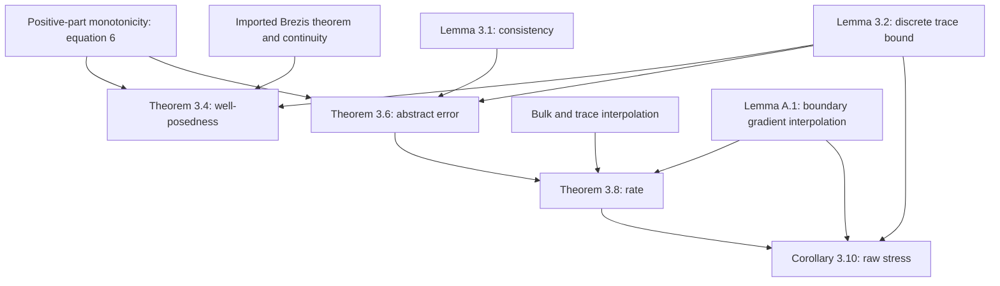

## 1. Paper identity and reading scope

Franz Chouly, Patrick Hild and Yves Renard, *Symmetric and non-symmetric variants of Nitsche’s method for contact problems in elasticity: theory and numerical experiments*, **Mathematics of Computation 84** (2015), 1089–1112; electronically published 2014. [DOI](https://doi.org/10.1090/S0025-5718-2014-02913-X) · [Zotero](zotero://select/library/items/MXR8M5PX) · [PDF](zotero://open-pdf/library/items/MWKAR6P6).

Read all 24 existing PDF pages, including Appendices A and B and references. Printed page = PDF page + 1088. Rendered pp. 1095 and 1100 were checked because text extraction loses the crucial $\ne$ sign in parameter conditions. The review uses the visually verified conditions. No outside paper was downloaded; proof explanations are a reading synthesis rather than an independent verification of every derivation.

## 2. Main contribution in plain language

The paper turns Nitsche contact enforcement into a **one-parameter family whose symmetry choice changes both mathematical robustness and numerical behavior**. The key result is that the skew-symmetric choice $\theta=-1$ retains discrete well-posedness and optimal mesh convergence for every fixed positive Nitsche parameter $\gamma_0$, while other choices require that parameter to be sufficiently small.

This matters because it keeps displacement as the only unknown while avoiding a separate contact multiplier space and the consistency error of ordinary penalization (§§1–2). The authors extend their earlier symmetric analysis; priority comparisons in the introduction are their historical claims, not independently researched here.

## 3. Main results and their scope

The problem is frictionless unilateral small-strain linear elasticity in 2D or 3D, against a rigid foundation, on fitted regular meshes with degree $k=1$ or $2$ Lagrange elements. The analytical setup has polygonal/polyhedral geometry, a flat potential contact boundary, and a nonzero-measure fixed boundary (§2).

**Consistency (Lemma 3.1):** a sufficiently regular exact contact solution satisfies the discrete Nitsche equation when tested by finite-element functions. Thus the extra terms do not introduce a model perturbation for an exact solution.

**Existence and uniqueness (Theorem 3.4, p. 1095):** the nonlinear discrete system has one solution if either $\theta\ne-1$ and $\gamma_0$ is sufficiently small, or $\theta=-1$ and $\gamma_0>0$ is arbitrary. This is not a theorem about Newton's global convergence.

**Optimal error estimate (Theorem 3.8, p. 1100):** if

$$u\in H^{3/2+\nu}(\Omega)^d,\qquad 0<\nu\le k-\tfrac12,$$

then, under the same parameter distinction,

$$\|u-u_h\|_{H^1(\Omega)}+\|\gamma^{1/2}(\sigma_n(u)-\lambda_h)\|_{L^2(\Gamma_C)}\le C h^{1/2+\nu}\|u\|_{H^{3/2+\nu}(\Omega)},$$

where $\lambda_h=-\gamma^{-1}[P_\gamma(u_h)]_+$ and $\gamma|_T=\gamma_0h_T$. The constant is independent of $h$ and $u$, but may depend on $\gamma_0$. $H^1$ measures displacement and first derivatives; the pressure estimate is **weighted by $\sqrt\gamma$**. “Optimal” means matching available smoothness and element degree, not always obtaining order two with quadratic elements.

For $u\in H^2$ the displacement rate is $O(h)$. Higher-order rates require higher regularity; the paper notes that contact-edge regularity can prevent full quadratic benefit (Remark 3.11). No assumption on a finite number of contact/noncontact transitions is added to Theorem 3.8.

**A second pressure quantity:** Corollary 3.10 bounds $\sqrt\gamma\,\sigma_n(u-u_h)$ with the same rate. The raw stress $\sigma_n(u_h)$ and reconstructed reaction $\lambda_h$ need not coincide at the discrete level (p. 1101).

**Essential qualifications:** unconditional admissibility of $\gamma_0$ for $\theta=-1$ does not imply parameter-independent accuracy: Remarks 3.7–3.9 show deteriorating constants at extreme values. The paper explicitly does not prove displacement $L^2$ error estimates using a usual Aubin–Nitsche argument (p. 1101). Appendix B gives concrete failure examples outside the safe symmetric parameter regime.

## 4. Method and mathematical setup

Displacement is $u$, strain $\varepsilon(u)=\tfrac12(\nabla u+\nabla u^T)$, stress $\sigma(u)=A\varepsilon(u)$, and $u_n=u\cdot n$. Contact imposes

$$u_n\le0,\quad\sigma_n(u)\le0,\quad u_n\sigma_n(u)=0,\quad\sigma_t(u)=0.$$

These mean no penetration, compression only, either opening or compression, and no tangential traction. The central rewrite (7) is

$$\sigma_n(u)=-\gamma^{-1}[u_n-\gamma\sigma_n(u)]_+.$$

Instead of finding a multiplier, the method evaluates the reaction through this positive-part relation. Define

$$P_\gamma(v)=v_n-\gamma\sigma_n(v),\qquad A_{\theta\gamma}(u,v)=a(u,v)-\int_{\Gamma_C}\theta\gamma\sigma_n(u)\sigma_n(v).$$

The discrete equation (10) is

$$A_{\theta\gamma}(u_h,v_h)+\int_{\Gamma_C}\gamma^{-1}[P_\gamma(u_h)]_+P_{\theta\gamma}(v_h)=L(v_h).$$

The three highlighted choices are symmetric $\theta=1$, fewer-term nonsymmetric $\theta=0$, and skew-symmetric $\theta=-1$. In the paper's convention the penalty strength is proportional to **$1/\gamma$**, so “small $\gamma_0$” corresponds to strong penalization, opposite to some other Nitsche conventions. Keeping this convention straight is necessary when comparing papers.

The analysis defines integrals exactly; computations use standard quadrature and generalized Newton iteration. These are solver and integration choices, separate from the discretization's mathematical existence statement (§4).

## 5. Analysis: what the authors are trying to prove

The authors want to show that enforcing a switching contact condition weakly gives a well-defined nonlinear finite-element solution and preserves the best approximation rate. The obstacle is that the contact boundary term is not automatically positive for every symmetry choice. The proof exploits monotonicity of the positive-part map and shows precisely which troublesome coefficient disappears for $\theta=-1$.

| Result (paper label and locator) | Plain-language meaning | Assumptions and earlier results used | Why this step is needed | Where it is used next |
|---|---|---|---|---|
| Positive-part inequality (6), p. 1092 | Switching cannot reverse the sign of a difference | Scalar monotonicity | Replaces linear positivity for the nonlinear term | Theorems 3.4 and 3.6 |
| Lemma 3.1, p. 1094 | Exact solution satisfies the discrete equation | $H^{3/2+\nu}$ regularity, identity (7), integration by parts | Eliminates consistency error when subtracting exact and discrete equations | Theorem 3.6 |
| Lemma 3.2, p. 1095 | Boundary normal stress of a discrete field is controlled by its bulk $H^1$ norm with factor $\gamma_0$ | Bounded elasticity tensor and mesh scaling | Bounds potentially destabilizing boundary terms | Theorems 3.4, 3.6; Corollary 3.10 |
| Theorem 3.4, pp. 1095–1097 | Nonlinear discrete problem has one solution | (6), Lemma 3.2, coercivity, continuity of positive part, imported Brezis operator result | Establishes existence and uniqueness before estimating error | Theorem 3.6 applies to that solution |
| Theorem 3.6, pp. 1097–1099 | Actual error is bounded by the best available displacement/trace/stress approximation | Lemma 3.1, (6), Lemma 3.2, Young inequalities, parameter conditions | Separates numerical method stability from approximation theory | Theorem 3.8 |
| Lemma A.1, pp. 1108–1109 | Interpolating a smooth solution also approximates its gradient on the boundary | Reference-element scaling, trace theorem, polynomial reproduction, imported fractional Deny–Lions lemma | Bulk interpolation alone does not bound boundary traction | Estimate (28), then Theorem 3.8 |
| Theorem 3.8, p. 1100 | Convert the abstract estimate to $h^{1/2+\nu}$ | Theorem 3.6, standard interpolation (26), trace interpolation (27), Lemma A.1/(28) | Produces the principal convergence rate | Corollary 3.10 |
| Corollary 3.10, p. 1101 | Raw finite-element normal stress also converges in a weighted norm | (28), Lemma 3.2/(11), (26), Theorem 3.8/(25) | Distinguishes raw stress from reconstructed reaction | Secondary conclusion |
| Appendix B, pp. 1109–1110 | Unsafe parameters can actually cause nonexistence/nonuniqueness | Direct single-triangle algebra, symmetric choice | Shows the restriction is not merely a weakness of the proof | Explains Remark 3.5; separate counterexample branch |

The first proof compares two trial displacements. Monotonicity makes much of the contact contribution favorable; Young's inequality splits the remaining mixed product into squares. The remaining bad stress-square coefficient is proportional to $(1+\theta)^2/4$ (equation (16), p. 1096). For $\theta=-1$ it vanishes. Otherwise Lemma 3.2 allows it to be absorbed into elastic energy when $\gamma_0$ is small. Coercivity means this energy cannot be small while the displacement difference is large. Continuity along any straight line in the finite-dimensional space, called hemicontinuity, completes the operator-theorem requirements.

The second proof repeats this comparison with an exact solution and an arbitrary finite-element approximant. Consistency is what makes subtraction legitimate. Good nonlinear terms now control the reaction error; remaining terms measure interpolation errors in the bulk, boundary displacement, and boundary stress. The final theorem inserts three matching interpolation rates. Appendix A is not optional decoration: it closes the boundary-stress estimate that ordinary bulk interpolation does not supply.

Appendix B belongs to a separate logical branch. For a single linear triangle with $\theta=1$ and specified material/parameter values, equation (29) has infinitely many solutions for $g_1=3g_2$ and none for $g_1>3g_2$. This proves a real possible failure outside the assumptions; it is not evidence that the safe symmetric method generally fails.

## 6. Experiments and supporting evidence

The Getfem++ tests compare variants on disk/sphere contact with a rigid plane (§4). They deliberately exceed the flat, zero-initial-gap analytical geometry: the computational boundaries are curved approximations with nonzero initial gap, and rigid motions are removed by selected point constraints rather than the theorem's positive-measure clamping.

- **2D disk:** radius 20 cm, $E=25$ MPa, Poisson ratio 0.25, plane strain, vertical body-force density 20 MN/m³. Mesh sizes span 0.5–10 cm; a 0.15 cm quadratic reference uses a different multiplier/Alart–Curnier contact discretization. Figures 2–4 compare linear elements; Figures 5–7 compare quadratic elements. Parameter samples are $\gamma_0=1/(100E),1/E,100/E$.
- **Observed distinction:** symmetric $\theta=1$ performs well for the smallest tested parameter but loses pressure accuracy and sometimes fails the Newton stopping target for larger values (§4.1). The $\theta=0$ case is more tolerant; $\theta=-1$ retains good convergence across the sampled values. Quadratic elements reduce errors but do not uniformly realize a full second-order rate, plausibly because of regularity limits.
- **3D sphere:** radius 20 cm and same material/load, linear meshes 3.6, 6, 11, 23 cm; quadratic 1 cm multiplier reference. Figures 9–11 show a similar parameter distinction, with deterioration for nonskew variants at larger $\gamma_0$.

Reference solutions are numerical, not exact. Regression slopes across these meshes are observations, not universal orders or guarantees of asymptotic behavior. The paper reports some superconvergence without interpreting it (§4.1). Solver failures are reported separately from discretization error; there is no general runtime superiority theorem.

## 7. Reviewer’s reflections: value, strengths, and limitations

**Reviewer judgement.** This is a strong paper to study after learning the contact complementarity condition. It connects a practical design choice—symmetry—to a visible algebraic cancellation and then checks the consequences numerically. The proof structure is unusually teachable: consistency, trace control, nonlinear well-posedness, abstract error, interpolation.

A particular strength is that the counterexample explains why a parameter condition matters, while the error-constant discussion prevents overstating the skew variant as parameter-insensitive. The two discrete pressure definitions are another useful lesson for interpreting contact plots.

The theorem does not establish frictional or finite-deformation robustness, and the authors identify friction as future work (§5). The numerical tests broaden the geometry but cannot extend the theorem by themselves. For your work, I would reuse the positive-part formulation and proof roadmap, then separately assess nonsymmetric linear-solver costs, quadrature near active-set transitions, and parameter scaling in your material units. Those are implementation questions prompted by the formulation, not defects established here.

## 8. Takeaways, questions, and connections

- $\theta=-1$ removes the main adverse coefficient in the monotonicity estimate.
- Every fixed positive parameter can be admissible while accuracy constants still depend on it.
- Consistency and convergence are different: Lemma 3.1 enables the later error proof but is not that proof.
- Boundary-stress interpolation is the indispensable final step in the optimal-rate argument.
- Reconstructed reaction and raw normal stress differ discretely.

Second reading: derive equation (16)'s $(1+\theta)^2$ coefficient; explain why $\gamma$ is proportional to $h$; determine the unweighted pressure rate implied on quasiuniform meshes; solve the two-variable counterexample in Appendix B.

| Source | Relation | Target | Evidence locator | Status |
|---|---|---|---|---|
| This paper | extends | Chouly–Hild symmetric Nitsche formulation | Introduction, reference [9] | Explicit |
| This paper | uses | Positive-part complementarity | (7) | Explicit |
| Theorem 3.8 | uses | Boundary gradient interpolation | Lemma A.1 | Verified dependency |
| [Burman–Hansbo–Larson review](Burman%20et%20al.%20%282016%29%20-%20Augmented%20Lagrangian%20finite%20elements.md) | discusses | This paper's Nitsche framework | Burman §2 and reference [15] | Verified in both existing PDFs |

[Back to the contact mechanics reading map](Contact%20Mechanics%20-%20Review%20Index.md)
