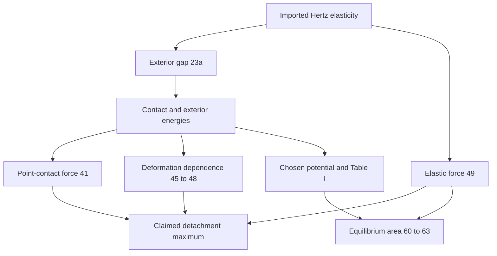

## 1. Paper identity and reading scope

**Derjaguin, Muller and Toporov (1975), Journal of Colloid and Interface Science 53(2), 314–326.** [Zotero item](zotero://select/library/items/2RCA2CRI), personal library 3933681; [DOI](https://doi.org/10.1016/0021-9797(75)90018-1).

Read all 13 pages of existing attachment **5U74EMPL**, including Sections I–II, the discussion, General Conclusions and references. Printed page = PDF page + 313. The source is scanned; rendered pp. 319, 321 and 322 were inspected to resolve principal equations and table entries. Some fine typography in intermediate integral manipulations remains difficult; the review avoids retranscribing uncertain formulas. No external versions were downloaded. Coverage is complete as a reading, not an independent proof audit.

## 2. Main contribution in plain language

The authors explain why **adhesion can create a finite elastic contact area without proportionally increasing the force required to detach the particle**. Their central addition is the molecular interaction in the annular region *outside* contact, included in an energy calculation based on the Hertz-deformed sphere (pp. 314–315, 318–320).

The important distinction is between the force associated with changing the whole equilibrium shape and a naive sum of attractive forces over a frozen contact patch. The latter can double-count physics already represented by elastic contact stresses (pp. 323–324). The authors call their theory strict; its explicit shape and material assumptions remain essential.

## 3. Main results and their scope

The principal result is that, in this model and without electrostatic adhesion, the maximum tensile force needed for separation equals the undeformed sphere–plane attraction at contact. Let $W=-\varphi(\epsilon)>0$ be work of separation per unit area; this is a normalized positive notation for the paper’s negative interaction potential. Then the **magnitude** is

$$F_{\mathrm{pull}}=2\pi R W.$$

This is Eq. [41] together with the detachment argument around Eq. [49] (pp. 319–321). For the chosen nonretarded attraction potential, Eq. [50],

$$\varphi(H)=-\frac{A}{12\pi H^2},\qquad
F_{\mathrm{pull}}=\frac{AR}{6\epsilon^2}.$$

Here $R$ is sphere radius, $A$ the Hamaker interaction constant, and $\epsilon$ the molecular contact spacing. The source writes a signed attractive $F_0<0$ in Eq. [51]; the displayed pull-off quantity here is positive magnitude.

Additional results: the sphere’s exterior gap is derived in Section I; the generalized attractive force has a point-contact limit $F_0$ and a large-indentation limit $F_0/2$ in this original energy formulation (Eqs. [48], [59], Table I); contact area is obtained by balancing attraction with the Hertz elastic reaction (Eqs. [60]–[63]). **Do not silently substitute a constant adhesive correction into this paper’s full finite-deformation force curve:** Table I explicitly varies with deformation.

**Assumptions:** smooth sphere against a much stiffer flat substrate; linear elastic, small contact geometry; the sphere is sufficiently stiff that molecular attraction does not appreciably change its exterior shape from the Hertz solution; reversible short-range molecular interaction; no electrostatic contribution to the stated pull-off result (p. 315 and Section II). The paper mentions replacing $R$ by $R_1R_2/(R_1+R_2)$ for two spheres (p. 315), but that does not erase the constitutive/shape restrictions. The result is not a universal adhesion law for soft, rough, plastic, charged, or dissipative particles.

## 4. Method and mathematical setup

The source’s two easily confused symbols are $a$ (contact radius) and $\alpha$ (approach of the sphere center). The Hertz geometry gives $a^2=R\alpha$ (Eq. [21]). $H$ is local surface separation, $\epsilon$ its value within contact, $E$ Young’s modulus, and $\sigma$ the paper’s Poisson ratio.

First, integrate the elastic half-space displacement generated by Hertz pressure to obtain the shape outside the contact disk. Second, divide the interaction energy into inside and outside parts:

$$
W_s=\underbrace{\pi a^2\varphi(\epsilon)}_{\text{contact contribution}}
+\underbrace{2\pi\int_a^\infty\varphi(H(r,\alpha))r\,dr}_{\text{outside-contact contribution}}.
$$

These are Eqs. [26] and [30]. A variable change $x^2=r^2-a^2$ makes the integration limits fixed (Eq. [31]); this is helpful because the contact radius changes during separation. Differentiate energy with respect to approach to obtain the generalized adhesive force. Separately, the Hertz elastic reaction is

$$F_e=\frac{4E\sqrt R}{3(1-\sigma^2)}\alpha^{3/2}$$

(Eq. [49]). An external tensile force must balance attraction minus elastic repulsion. It is this changing balance, not simply initial contact area, that determines detachment.

## 5. Analysis: what the authors are trying to prove

The destination is to determine where the required tensile force is largest as contact shrinks. The main obstacle is accounting for the adhesive energy outside the contact without confusing force at fixed geometry with force along a changing shape. There are **no named lemmas or theorems**; the actual dependencies are analytical calculations labelled by equation.

| Result (paper label and locator) | Plain-language meaning | Assumptions and earlier results used | Why this step is needed | Where it is used next |
|---|---|---|---|---|
| Eqs. [1]–[3], pp. 315–316 | Hertz pressure produces an elastic surface displacement | Imported Hertz pressure and elastic point-load response | Supplies the physical geometry | Exterior-gap calculation |
| Eqs. [5]–[15], pp. 316–317 | Integrals/series reduce the displacement to a usable expression | [3], elliptic-integral and series identities [6]–[14] | Allows evaluation outside contact | [22]–[23a] |
| Eqs. [16]–[23a], pp. 317–318 | Establish approach–radius relation and actual gap including molecular spacing | Earlier displacement; small-slope sphere geometry | Converts deformation into the separation that controls attraction | [29]–[32] |
| Eqs. [24]–[33], pp. 318–319 | Split elastic/surface energy and surface contact/noncontact energy | Reversible interaction; derived gap | Ensures outside-contact energy is retained | Force differentiation [34] |
| Eqs. [34]–[41], p. 319 | In the point-contact limit both surface-energy pieces contribute $\pi R\varphi(\epsilon)$ | [27], [31]–[39], potential vanishing at infinity | Recovers the full $2\pi R\varphi(\epsilon)$ instead of half | Pull-off argument |
| Eqs. [42]–[44], p. 320 | Noncontact sphere attraction joins the contact limit continuously | Undeformed gap approximation and energy derivative | Cross-checks the limiting force | Interpretation of [41] |
| Eqs. [45]–[49], pp. 320–321 | Adhesive magnitude initially decreases with approach; elastic reaction increases | Gap derivatives, decreasing attraction potential, Hertz law | Locates the claimed detachment maximum at vanishing contact | General conclusion |
| Eqs. [50]–[59], pp. 321–322 | Specific potential gives numerical force curve and two asymptotic regimes | Chosen inverse-square potential; [33]–[35] | Makes general reasoning concrete and checks limits | Table I; area estimate |
| Eqs. [60]–[63], pp. 322–323 | Balance gives adhesion-induced contact area | Force law plus Hertz reaction | Explains finite contact despite unchanged pull-off maximum | Table II |

The elliptic integrals are machinery for answering “how close are the surfaces outside the patch?” You need not master them to understand the main idea. Once the gap is known, interaction energy can be counted consistently. At vanishing contact the inside and outside energy derivatives each supply half the total attraction. As the sphere becomes more compressed, the elastic restoring force grows, so a larger contact patch does not directly translate into a larger pull-off force.

**Qualification of the analysis:** Eqs. [45]–[48] establish a small-approach argument; the paper then asserts the broader decreasing behavior and supports it with the chosen potential’s asymptotics and Table I. This is not a separately stated global monotonicity theorem with comprehensive hypotheses for every possible interaction potential. The review preserves that distinction rather than converting the authors’ general discussion into a stronger theorem.

## 6. Experiments and supporting evidence

No new laboratory experiment is reported. **Table I (p. 322)** numerically evaluates the force integral and compares asymptotic expansions: the exact normalized value decreases from 0.9967 at $\alpha/\epsilon=10^{-5}$ toward 0.5004 at $10^4$. This supports the predicted limiting trend for the selected potential, not all potentials.

**Table II (p. 322)** gives calculated polystyrene-on-steel contact areas for radii 0.03–30 micrometers with specified material and molecular parameters. It illustrates finite equilibrium contact; it is not measured validation. Figure 3 is a schematic force-balance picture. The discussion on pp. 323–325 interprets earlier experiments and electrostatic charging; those cited experiments were not independently read here.

## 7. Reviewer’s reflections: value, strengths, and limitations

**Reviewer’s judgement.** The most valuable lesson is careful energy bookkeeping: adhesion outside apparent contact can be crucial, and an elastic reaction should not be combined with molecular forces in a way that counts the same interaction twice (pp. 319–320, 323). The derivation also connects an abstract surface energy to an easily interpretable force proportional to radius.

The main limitation is explicit and structural: **assuming the Hertz exterior shape while studying adhesion–deformation coupling** excludes regimes in which adhesion significantly reshapes that exterior (p. 315). The word “strict” should not obscure this approximation. The paper’s criticism of the soft-contact treatment in reference [2] is the authors’ position, not an independently established comparison in this review.

A second limitation is evidence strength: the general force-curve conclusion is more broadly worded than the local expansion plus the particular-potential calculation strictly establishes. Table I is useful, but it does not substitute for a global proof for arbitrary potentials. The treatment of electrostatic effects is a separate explanatory discussion using prior reports, not a controlled test in this article.

For your study, read the energy split and point-contact limit first, then trace the shape derivation only as needed. This is valuable conceptual groundwork for adhesive contact, but it provides neither a general numerical contact algorithm nor a ready constitutive model for every material regime.

## 8. Takeaways, questions, and connections

- Finite adhesive contact area and maximum detachment force are different quantities.
- Outside-contact adhesion contributes half the point-contact energy derivative in this derivation.
- The pull-off magnitude is $2\pi RW$ within the stated model.
- Preserve the original paper’s deformation-dependent force curve and explicit Hertz-shape assumption.

Second-reading questions: At what material/radius scale would adhesion noticeably invalidate the assumed gap shape? Where does the local monotonicity argument stop and the broader interpretation begin? What evidence would distinguish molecular adhesion from electrostatic adhesion in a given experiment?

| Source | Relation | Target | Evidence locator | Status |
|---|---|---|---|---|
| This model | uses | Hertz contact geometry | Section I; [1], [21] | Explicit |
| This model | extends | Derjaguin 1934 energy treatment | Introduction; p. 320 | Author-stated; prior work not independently read |
| This paper | compares-with | Johnson–Kendall–Roberts 1971 | p. 315; reference [2] | Author discussion; superiority not independently verified |
| Molecular pull-off calculation | excludes | Electrostatic adhesion | pp. 324–325 | Explicit scope distinction |

[Back to the contact mechanics reading map](Contact%20Mechanics%20-%20Review%20Index.md)
