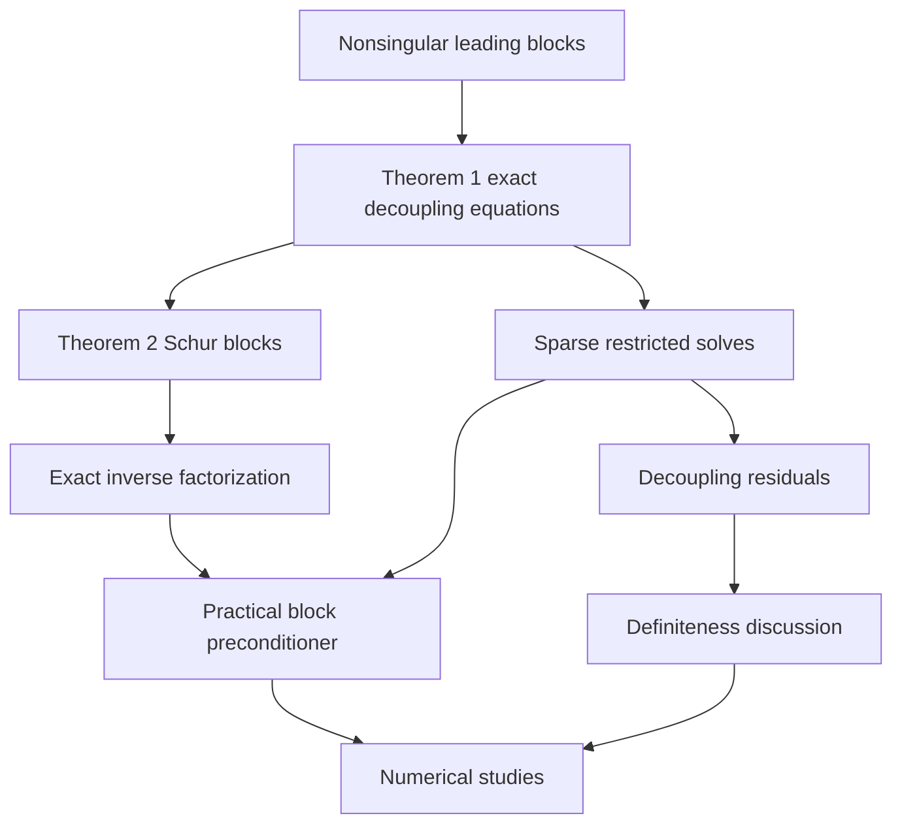

## 1. Paper identity and reading scope

Ferronato et al. (2019), *Journal of Computational Physics* **398**, 108887. [DOI](https://doi.org/10.1016/j.jcp.2019.108887) · [Zotero item](zotero://select/library/items/7EXMTSJB) · [PDF](zotero://open-pdf/library/items/N5R3J92N).

Read all 23 PDF pages, including Theorems 1–2, both applications, discussion, Appendices A–B and references. PDF and article page numbers coincide. The title/authors match the item. Page 18 was visually checked for the residual identities and Fig. 16. This review includes a clearly marked elementary qualification of a definiteness claim; it is not a full independent proof audit or reproduction of experiments.

## 2. Main contribution in plain language

**The paper organizes block preconditioning around approximate decoupling: construct sparse transformations that remove most cross-field interaction, then solve the transformed diagonal blocks with suitable local preconditioners.** It connects those transformations to independently solvable multiple-right-hand-side systems and identifies the exact transformed blocks as Schur complements (§2).

A Schur complement is what one group of unknowns “feels” after another group has been eliminated. The value of this framework is that it makes the coupling approximation an explicit object to design, rather than requiring one monolithic solver for all physical variables. The authors propose a general algebraic starting point, explicitly not a universally optimal preconditioner (§1; §4).

## 3. Main results and their scope

**Theorem 1, pp. 4–5.** For the specified unit block-triangular factors, exact block diagonalization $GAF=S$ is equivalent to solving

$$A_iF_{i+1}=-B_{i+1},\qquad G_{i+1}A_i=-C_{i+1}.$$

Here $A_i$ is the leading principal block containing the first $i$ fields, and $B_{i+1},C_{i+1}$ collect their couplings to the next field. The leading blocks are assumed nonsingular. This tells us exactly what to approximate.

**Theorem 2, p. 5.** With these exact factors,

$$S_i=A_{ii}-C_iA_{i-1}^{-1}B_i.$$

Thus the diagonal blocks are successive Schur complements. For the first block, $S_1=A_{11}$. If the full system is nonsingular, the exact inverse is $A^{-1}=FS^{-1}G$ (Eqs. 24–25).

**Practical construction, Eqs. 28–30.** Restrict the factor entries to sparse patterns, solve small principal subproblems, and approximate the inverse diagonal blocks. This is a preconditioner, not exact decoupling. The theorems do **not** prove mesh-independent iteration counts, parameter-uniform spectral bounds, or optimal complexity for the sparse implementation.

**Numerical evidence.** Both three-field poromechanics and two-field fault mechanics are solved with Bi-CGStab; parameter sweeps reveal useful and problematic sparsity regimes. Table 4 shows a contact test ranging from more than 1000 iterations for a very sparse/loose choice to about 100 for tighter choices. The implementation therefore still needs informed tuning.

## 4. Method and mathematical setup

Start with $Ax=b$ partitioned by physical field or constraint variable. The factors $F$ and $G$ are upper and lower unit block-triangular transformations. Exact transformations give $S=GAF$ block diagonal, so applying $A^{-1}$ means transform the residual with $G$, solve the independent blocks of $S$, and transform back with $F$.

Exact factors are generally dense. The practical algorithm chooses a small index set per factor row/column, solves a reduced dense system on that set (Eq. 29), builds approximate Schur blocks, and applies local incomplete factorizations or sparse approximate inverses. “Fill” is the number of retained nonzero entries: more fill can improve decoupling but costs setup time, memory and application work. Independent local systems make factor construction parallelizable, while the chosen local block solvers have their own costs.

For **fault/contact mechanics**, the system is

$$A=\begin{bmatrix}K+E&C-F_c\\C^T&0\end{bmatrix},\qquad
S_2=-C^T(K+E)^{-1}(C-F_c).$$

I write the paper's low-rank matrix $F$ as $F_c$ here to avoid confusing it with the global upper factor $F$. $K+E$ is the positive-definite structural block; the second unknown group is Lagrange multipliers; $C$ couples displacements and constraints; $F_c$ represents the activated-fault nonsymmetric correction (Eqs. 42–53). The exact multiplier Schur complement is dense even though the original matrix is sparse, which makes cheap sparse approximation difficult (Fig. 14).

For **poroelasticity**, displacement, Darcy velocity and pressure yield three blocks. The pressure Schur complement is

$$S=Q^TK^{-1}Q+\gamma B^TA_v^{-1}B+P,$$

where $A_v$ denotes the paper's Darcy mass block $A$, $P$ is storage, and $\gamma=\vartheta\Delta t$ is a time-discretization factor (Eqs. 31, 41). Small and large time steps change which coupling dominates. The preconditioner addresses the algebraic solve; it does not fix an unstable discretization. The authors explicitly acknowledge the need for stabilization near the undrained limit (§3.1).

## 5. Analysis: what the authors are trying to prove

The authors want to establish an exact algebraic target for decoupling, then show how to approximate it sparsely. The main obstacle is that exact elimination produces dense coupling operators and Schur complements. There are two main theorems and no supporting named lemmas.

| Result (paper label and locator) | Plain-language meaning | Assumptions and earlier results used | Why this step is needed | Where it is used next |
|---|---|---|---|---|
| Leading-block nonsingularity assumption, p. 4 | Every partial elimination is possible | Assumed, not proved from the applications here | Makes factor-defining solves meaningful | Theorem 1 and inverse expressions |
| Theorem 1, Eqs. 10–18 | Cancellation of cross-field blocks is exactly a set of linear solves | Block forms of $A,F,G$; direct two-block multiplication and recursive extension | Defines the exact decoupling factors operationally | Theorem 2 and sparse reduced solves |
| Theorem 2, Eqs. 21–23 | Each surviving block is a Schur complement | Theorem 1 substituted into block product Eq. 22 | Identifies what the local solvers must approximate | Exact inverse, Eqs. 24–25; application formulas |
| Remarks 1–2, p. 5 | Relates the construction to block FSAI; SPD case has a minimization interpretation | Imported result from reference [38]; additional symmetry/positivity for Remark 2 | Connects to existing factor/pattern machinery | Practical factor computation; not an extra theorem needed for Theorem 2 |
| Eqs. 28–30 | Replace dense exact solves with sparse-pattern subproblems | Chosen index sets and solvable reduced systems | Makes the method affordable | Numerical implementations |
| Eqs. 54–57, p. 18 | Factor errors can subtract positive energy from an approximate Schur block | SPD physical blocks; residual definitions | Explains loss of definiteness despite a positive exact block | Alternative Eq. 59 and Fig. 16 |
| Eq. 59 and discussion, pp. 18–19 | A sum-of-Gram-matrices approximation avoids negative quadratic forms | Nonnegative storage and positive physical blocks; strict positivity needs an extra rank/nullspace condition | Motivates a more robust approximation | GMRES comparison in Fig. 16 |

Theorem 1 is best understood by ordinary elimination: choose an off-diagonal transformation so that one cross-block becomes zero, then repeat with one more field. Theorem 2 substitutes that cancellation into the diagonal entry, revealing the familiar “original block minus feedback through eliminated variables” formula. The practical algorithm approximates those cancellation solves. The proof stops short of showing that every affordable approximation is a good preconditioner; the experiments and discussion address that remaining question.

The residual identity clarifies why sparsity can cause trouble:

$$S_3=S-\left(R_Q^TK^{-1}R_Q+\gamma R_B^TA_v^{-1}R_B\right).$$

Each residual term is positive semidefinite, so approximation can remove too much positive energy. This is a structural warning, not simply “a bigger entrywise error gives more iterations.” See the precise qualification of Eq. 59 below.

## 6. Experiments and supporting evidence

**Mandel diagnostic problem, §3.1.1, Figs. 6–10.** Exact and approximate Schur patterns are compared across time-step regimes. Parameter sweeps examine $\|I-S_3^{-1}S\|_2$ and Bi-CGStab counts. The matrix norm measures worst-case Euclidean amplification by the Schur approximation error, not a displacement error. Direct block solves are used in this diagnostic, isolating the coupling approximation more clearly than the later inexact-block experiments.

**Larger poromechanics cases, Tables 2–3.** Mandel80, Treporti and Reservoir contain 389,627, 404,548 and 1,550,011 unknowns. Runs use eight OpenMP cores on Xeon E5-2680 v2 processors at 2.80 GHz with 256 GB RAM, inexact ABF-IC block solves, and a residual reduction target $10^{-8}$, followed by a true-residual check. The Reservoir cases take 182–299 iterations; their solve times are 17.740–28.435 s, with setup reported separately. These results demonstrate workable solves, not superiority against a comprehensive alternative-solver baseline.

**Fault mechanics, Table 4 and Tables 5–6.** The small cracked-body sweep shows fill sensitivity. With tolerance $10^{-1}$ and one Schur entry retained per row, convergence takes over 1000 iterations; at tolerance $10^{-3}$ and five entries it takes 107. Larger Cracked rock, Queretaro and Wuxi have 171,093, 183,177 and 72,666 unknowns, requiring 349, 84 and 25 iterations. These runs use one core on Xeon E5-2643 hardware at 3.30 GHz with 256 GB RAM and ILU(0) local solves. Reported solve times are 12.68, 7.21 and 0.45 s, excluding the separately reported setup. They must not be compared directly against the eight-core poromechanics timings as if hardware and workloads matched.

**Definiteness test, Fig. 16.** Full GMRES on Mandel's problem compares Eqs. 38 and 59 over $\gamma$. The Gram-form variant is more stable for small $\gamma$ in this test; the original form can be slightly better elsewhere. This supports a robustness/accuracy tradeoff rather than universal dominance.

## 7. Reviewer’s reflections: value, strengths, and limitations

**Reviewer’s judgement.** This is especially useful if your contact research leads to saddle-point systems and preconditioners. The exact factorization story is short and understandable, and the paper clearly exposes where implementation choices replace algebraic identities with approximations.

Its strengths include explicit setup/application separation, actual large sparse systems, true-residual checking, and an unusually candid discussion of failures. The authors acknowledge dense contact Schur complements, adaptive-pattern cost and near-tied scores becoming machine-dependent (§§3.2.1, 4). Setup reuse also assumes sufficiently unchanged operators; in fault mechanics it relies on constant $K$ and neglecting changes in $E$ for preconditioning (p. 17).

**Reviewer-derived mathematical qualification.** The statement on p. 19 that Eq. 59 is *strictly* positive definite for arbitrary $F_{13},F_{23}$ is too strong without an additional assumption. The formula

$$\widehat S_3=P+F_{13}^TKF_{13}+\gamma F_{23}^TA_vF_{23}$$

is automatically positive **semidefinite** when $P\succeq0$ and $\gamma\ge0$. For $\gamma>0$, strict positivity requires that $\ker P\cap\ker F_{13}\cap\ker F_{23}=\{0\}$, or a sufficient condition such as $P\succ0$. If $P=0$ and both factors are zero, the expression is zero, contradicting “any” factors. This elementary observation qualifies the universal wording; it does not demonstrate failure of the tested factor constructions. It matters because incompressible storage is allowed in the applications (Table 1; §3.1.1).

The main evidence limitation is the absence of parameter-uniform spectral bounds and broad head-to-head timings. I would use the framework as a design starting point, then test block ordering, constraint rank, sparse-pattern quality, factorization stability and amortized total time on the target application.

## 8. Takeaways, questions, and connections

- Exact block decoupling is a set of independent multiple-right-hand-side solves.
- The transformed diagonal blocks are Schur complements, not simply the original single-field matrices.
- Contact multiplier Schur complements may be dense even for sparse FE matrices.
- Preserving quadratic-form structure can matter more than a seemingly closer approximation.
- Algebraic preconditioning cannot cure a fundamentally unstable discretization.

Second reading: What changes if the fields are reordered? Which factor patterns retain the important constraint interactions? Is the approximate Schur block provably nonsingular for your chosen pressure/multiplier space?

| Source | Relation | Target | Evidence locator | Status |
|---|---|---|---|---|
| Theorem 1 | defines | Exact decoupling factors | Eq. 10 | Proved in paper |
| Theorem 2 | identifies | Schur complements | Eq. 23 | Proved in paper |
| This paper | preconditions | Lagrangian fault/contact systems | §3.2; Appendix B | Explicit |
| This paper | uses | Block sparse approximate inverse construction | §2; Remarks 1–2 | Explicit |
| This paper | connects-to | [Simo et al. (1985) - Perturbed Lagrangian contact](Simo%20et%20al.%20%281985%29%20-%20Perturbed%20Lagrangian%20contact.md) mixed contact multipliers and elimination | This paper Eq. 42; other paper §4 | Reviewer conceptual connection; different discretizations |

[Back to the contact mechanics reading map](Contact%20Mechanics%20-%20Review%20Index.md)
