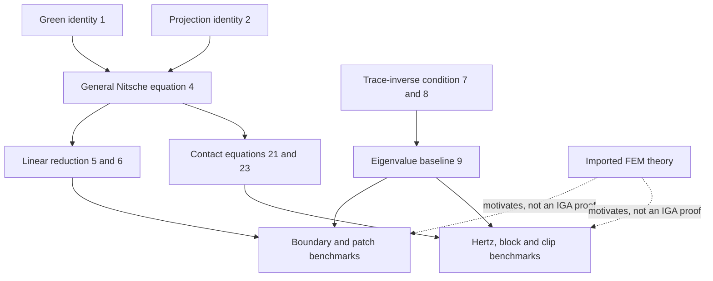

## 1. Paper identity and reading scope

Qingyuan Hu, Franz Chouly, Ping Hu, Gengdong Cheng and Stéphane P. A. Bordas, *Skew-symmetric Nitsche’s formulation in isogeometric analysis: Dirichlet and symmetry conditions, patch coupling and frictionless contact*, **Computer Methods in Applied Mechanics and Engineering 341** (2018), 188–220. [DOI](https://doi.org/10.1016/j.cma.2018.05.024) · [Zotero](zotero://select/library/items/S7PB8MM5) · [PDF](zotero://open-pdf/library/items/ZYL68GAT).

Read all 33 PDF pages, including all application sections and references. Printed page = PDF page + 187. Rendered pp. 211–212 and 215 were inspected for Hertz parameters, pressure comparison, iteration counts, and clip setup. No additional paper was obtained. The paper presents derivations and computational evidence, not a new complete IGA convergence proof; coverage is complete while mathematical claims are classified accordingly.

## 2. Main contribution in plain language

The main contribution is a **unified, practical route for applying skew-symmetric Nitsche enforcement to several IGA constraints, including frictionless contact**, accompanied by a broad benchmark study. It treats displacement constraints, plate rotations, patch joins, and contact through the same conjugate-variable/projection construction.

The central practical distinction is: **linear constraints can use a parameter-free skew formulation, but the contact formulation here cannot** (Remark 2, p. 198). For contact the evidence is instead robustness over a large tested parameter range. This distinction is easy to lose when reading the title or highlights.

IGA uses NURBS for geometry and fields, but control variables generally are not interpolated point values. Directly prescribing a boundary condition is therefore less straightforward than in nodal Lagrange FEM. Nitsche enforcement works through boundary integrals and adds no multiplier degrees of freedom (§§1–2).

## 3. Main results and their scope

**Derived results:** equations (1)–(6) give a consistent algebraic construction from a Green identity and a projection representation of the constraint. Sections 3.3–3.5 instantiate it for elasticity, Kirchhoff–Love rotational symmetry, patch coupling, and biased/unbiased frictionless contact. Section 3.2 supplies a trace-inverse coercivity argument for a sufficiently large stabilization operator in the symmetric setting.

**Imported theory, not a new theorem here:** the authors refer to existing FEM stability and error analyses and explicitly say at the end of §3.2 (p. 194) that comparable IGA results are expected although no numerical analysis has been provided to their knowledge. Thus this paper's IGA convergence and robustness conclusions are largely **numerically demonstrated**, not established by a new lemma-to-theorem proof chain.

**Computational results:**

- Parameter-free skew enforcement reaches expected energy-norm rates in linear boundary and plate tests (Figures 7 and 10).
- Static patch coupling yields similar accuracy for symmetric/skew methods, while the skew matrices have smaller reported condition numbers in the tested configurations (Table 2).
- Coupling adds high-frequency spectral outliers localized near interfaces (Figures 19–22). This is a cost, not a claimed improvement.
- Hertz contact produces increasingly accurate pressure distributions and an energy-error rate around 1.41 for quadratic IGA, with markedly better solver tolerance to small stabilization values for the skew method (Figures 25–26, Table 3).
- Nonmatching block contact and 3D clip self-contact demonstrate applicability; these are not universal contact patch-test exactness or large-deformation convergence theorems (Table 4, Figure 31).

All physical examples are situated in small-strain mechanics. The final discussion presents large-deformation contact as further work, not an established capability of this article's analysis.

## 4. Method and mathematical setup

The abstract weak equation (1) is

$$a(u,v)-\langle\tau(u),B(v)\rangle_\Gamma=L(v).$$

Here $a$ is internal work, $L$ external work, $B(v)$ a boundary displacement-like quantity, and $\tau(u)$ its work-conjugate force-like quantity. Examples are displacement/traction and rotation/bending moment. The constraint is written as a projection (2):

$$\tau(u)=[\tau(u)-\gamma(B(u)-\bar B)]_S.$$

Projection means selecting the closest admissible value in $S$; for compressive-only contact, projection onto $\mathbb R_-$ replaces positive tensile reactions by zero. $\bar B$ is prescribed displacement, rotation, or initial gap.

The discrete operators are

$$A_\theta(u_h,v_h)=a(u_h,v_h)-\theta\langle\tau(u_h),\gamma_h^{-1}\tau(v_h)\rangle_\Gamma,\qquad P_\theta(v_h)=\theta\tau(v_h)-\gamma_hB(v_h).$$

Equation (4) then reads

$$A_\theta(u_h,v_h)+\langle[P_1(u_h)+\gamma_h\bar B]_S,\gamma_h^{-1}P_\theta(v_h)\rangle_\Gamma=L(v_h).$$

For linear constraints $S=\mathbb R^k$, projection is the identity. Expanding gives equation (5), in which $\theta=-1$ permits $\gamma_h=0$ and the remaining two boundary terms are skew partners. This zero-parameter limit is taken after algebraic simplification: one should not put zero into the unsimplified $\gamma_h^{-1}$ formula.

For contact, $B(u)=u_n$, $\tau(u)=\sigma_n(u)$, $\bar B=g$ and $S=\mathbb R_-$. The KKT conditions are $u_n-g\le0$, $\sigma_n\le0$, and $\sigma_n(u_n-g)=0$ (20). The nonlinear projection prevents the same cancellation, so equation (21) still requires positive $\gamma_h$. The unbiased version (23) integrates half-weighted contributions over both surfaces, eliminating a fixed master/slave distinction.

**Notation warning:** this paper's $\gamma_h$ is an interface **stiffness**, whereas Chouly–Hild–Renard 2015 use $\gamma$ in a reciprocal, compliance-like role. Small $\gamma_h$ here is weak stabilization; small $\gamma$ in that paper is strong penalization. Their parameter trends are not contradictory.

## 5. Analysis: what the authors are trying to prove

The authors primarily want to establish a systematic derivation and demonstrate that skew enforcement works well with NURBS spaces. The mathematical obstacle is that boundary fluxes can be large relative to bulk energy, and nonlinear contact projections complicate cancellation. There are **no numbered lemmas or theorems in this paper**. The following table maps the actual derivation and evidence chain instead of inventing proof labels.

| Result (paper label and locator) | Plain-language meaning | Assumptions and earlier results used | Why this step is needed | Where it is used next |
|---|---|---|---|---|
| Green identity (1), p. 191 | Relate bulk equilibrium to boundary work | Chosen PDE, work-conjugate variables, sufficient regularity | Ensures the boundary terms have the right physical meaning | Derivation (3)–(4) |
| Projection identity (2), p. 192 | Express the desired constraint as an algebraic switch | Appropriate admissible set $S$ and positive invertible operator $\gamma$ | Encodes both linear constraints and contact | General formulation (4) |
| Splitting and insertion (3)–(4), p. 192 | Add consistent Nitsche terms | (1), (2), parameter $\theta$ and discrete fluxes | Produces a single template for all examples | Linear reduction (5), contact (21), (23) |
| Linear reduction (5)–(6), pp. 192–193 | For linear constraints the skew form permits zero stabilization | Projection is identity; $\theta=-1$ | Explains parameter-free boundary/patch treatment | §§3.3–3.4; linear benchmarks |
| Trace-inverse condition (7)–(8), p. 193 | Stabilization can dominate the adverse boundary flux-square term | Finite trace-inverse constant, suitable bulk energy control | Gives a sufficient symmetric coercivity condition | Eigenvalue choice (9) |
| Generalized eigenproblem (9), pp. 193–194 | Compute the largest boundary-flux/bulk-energy ratio | Discrete matrices and appropriate treatment of admissible modes | Supplies the tested reference stabilization $2\lambda_{\max}$ | Symmetric comparisons and contact parameter baseline |
| FEM results cited in §3.2, p. 194 | Existing methods have stability/convergence theory | External FEM hypotheses; proofs not reproduced | Motivates expected IGA behavior | Numerical study, not an IGA theorem |
| Contact substitutions (20)–(23), pp. 198–199 | Obtain biased/unbiased contact without extra multipliers | Normal gap map, compression-only projection, small strain | Transfers the abstract construction to contact | Hertz, blocks, clip |
| Numerical studies §4 | Test accuracy, conditioning, spectrum and contact solution behavior | Chosen geometries, spaces, quadrature, solvers and references | Establishes the application evidence actually supplied here | Conclusions §5 |

The high-level argument is: choose the boundary work pair correctly, rewrite the constraint as a projection, and insert that identity into the weak equation. This makes the method consistent. In the linear case the projection disappears, exposing the skew cancellation and a penalty-free form. In the symmetric case boundary-flux energy can spoil stability, so bound it by the largest trace-inverse ratio and choose stabilization above that ratio. For contact retain the nonlinear projection and positive stabilization. Finally run separate tests for approximation, conditioning, spectral effects and contact switching.

The coercivity calculation in §3.2 is only one component of a full convergence proof. It does not supply the IGA approximation estimates, nonlinear error bounds, quadrature effects, and all geometric hypotheses by itself. An arrow from that calculation directly to “proved optimal IGA contact convergence” would overstate the paper.

## 6. Experiments and supporting evidence

The implementation uses the C++ Gismo IGA library, generally $C^{p-1}$ elements with $p+1$ Gauss points in each direction (§4). Contact examples use quadratic NURBS. No timing-based speedup claim follows from the reported iteration counts.

| Test and locator | Claim tested | Outcome and limitations |
|---|---|---|
| Rectangular/circular boundary tests, Table 1/Figure 7, pp. 200–201 | Correct weak displacement enforcement and refinement | Rectangular polynomial tests pass up to represented order; circular energy errors converge at order $p$. Not all circular fields are represented exactly. |
| Kirchhoff symmetry, Figure 10, p. 203 | Weak rotational constraints | Both Nitsche variants achieve expected energy order $p-1$; the second-row penalty alternative is parameter sensitive. Energy here involves second derivatives, unlike elasticity's first derivatives. |
| Two-patch plate, Figures 12–13/Table 2, pp. 204–206 | Accuracy and matrix conditioning cost of coupling | Skew and symmetric accuracy comparable; reported condition numbers (scaled by $10^{10}$) substantially smaller for skew. Numbers refer to these matrices, not a general solver-complexity result. |
| Eight-patch annular plate, Figures 15–17, pp. 205–208 | Curved nonmatching interfaces | Maximum-deflection errors reported as −0.58% skew and −0.12% symmetric. This example does not establish universal skew accuracy superiority. |
| Four-patch rod spectra, Figures 19–22, pp. 207–210 | Dynamic cost of artificial interfaces | Low frequencies close to conforming IGA; extra high-frequency outliers and interface-localized modes appear. |
| Hertz, Figures 23–26/Table 3, pp. 210–213 | Pressure profile, refinement and parameter robustness | Refinement approaches analytical profile; energy rate 1.41 against a $128\times128$ reference at baseline stabilization. Skew remains effective at the two much smaller sampled stabilization values. |
| Nonmatching blocks, Table 4/Figures 28–29, pp. 212–214 | Constant-pressure transfer and biased/unbiased behavior | Small but nonzero errors; unbiased skew stress range −0.551% to 0.636%, biased skew −1.157% to 1.542%. This is not an exact contact patch-test pass. |
| 3D clip, Figures 30–31, pp. 214–216 | Unbiased self-contact applicability | Largest downward displacement changes from −0.09413 without effective contact to −0.01024 after convergence, with initial gap 0.01; ABAQUS comparison gives reported extreme-displacement errors 0.196% and −3.042%. One example, no mesh-convergence proof. |

The rendered Hertz setup (Figure 23) gives $E=0.02\times10^9$, $\nu=0.1$, $r=0.2$, $g_z=-1.3\times10^6$ in the figure's unlabelled consistent units. Table 3 gives a particularly concrete comparison: on the $64\times64$ mesh both variants need 52 semi-smooth Newton iterations at $\gamma_0^{ref}=2\lambda_{\max}$. At $\gamma_0^{ref}/10^4$, the symmetric case exceeds 100 iterations while skew uses 11; at $\gamma_0^{ref}/10^5$, they use 45 and 10. The symmetric behavior is not monotonic in the parameter, so “smaller always fails” would be inaccurate.

The clip's figure lists $E=200\times10^9$, $\nu=0.3$, $t=0.5$, gap 0.01 and traction $10^6$, again without explicit unit labels. The demonstration uses small deformation relative to this geometry and must not be relabelled as validated finite-strain self-contact.

## 7. Reviewer’s reflections: value, strengths, and limitations

**Reviewer judgement.** This paper is most valuable as an implementation-oriented bridge between Nitsche theory and IGA. The conjugate-pair recipe makes apparently different boundary problems look like variations of one construction. Including conditioning and modal outliers alongside accuracy is a substantial strength: it exposes effects that a static displacement plot would hide.

For contact, Table 3 is persuasive evidence of robustness in a specific parameter sweep, and the unbiased clip example shows why a fixed master/slave choice can be inconvenient. The accuracy/conditioning study does not imply universal computational superiority: nonsymmetric algebra, assembly and linear solves still need evaluation in your own implementation.

The largest qualification is explicit in the paper: IGA convergence theory is expected by analogy rather than proved (§3.2). The contact patch test also retains nonzero errors (Table 4). Neither prevents the method from being useful, but both matter if you need strict conservation/patch consistency guarantees or a complete mathematical justification.

I would read this **after** [Chouly–Hild–Renard](Chouly%20et%20al.%20%282015%29%20-%20Nitsche%20contact%20analysis.md): that review explains the rigorous contact monotonicity mechanism; this paper then shows its implementation and empirical consequences in smooth CAD-based spaces. The reciprocal parameter conventions are worth recording beside any code or comparison table.

## 8. Takeaways, questions, and connections

- Boundary work pairs and projection sets organize the whole method.
- “Parameter-free” applies to linear constraints here; contact still has positive stabilization.
- The IGA evidence is computational, supported by imported FEM theory rather than a new complete IGA proof.
- Patch coupling can improve modeling flexibility while adding spectral artifacts.
- A robustness result over sampled parameters is not a guarantee of universal solver performance.

Second reading: expand (4) with identity projection to recover (5); explain why zero stabilization is then legal but not in (21); compare Table 3 iteration counts with the actual pressure error; identify which missing IGA estimates would be needed for a full convergence theorem.

| Source | Relation | Target | Evidence locator | Status |
|---|---|---|---|---|
| This paper | applies | [Chouly–Hild–Renard Nitsche contact](Chouly%20et%20al.%20%282015%29%20-%20Nitsche%20contact%20analysis.md) to IGA | §§3.2, 3.5, reference [57] | Explicit |
| General equation (4) | specializes-to | Biased/unbiased contact | (21), (23) | Derived |
| Skew patch coupling | introduces | Interface-localized spectral outliers | Figures 20–22 | Numerical observation |
| Contact method | compares-with | Symmetric Nitsche | Table 3/Figure 26 | Numerical comparison |

[Back to the contact mechanics reading map](Contact%20Mechanics%20-%20Review%20Index.md)
