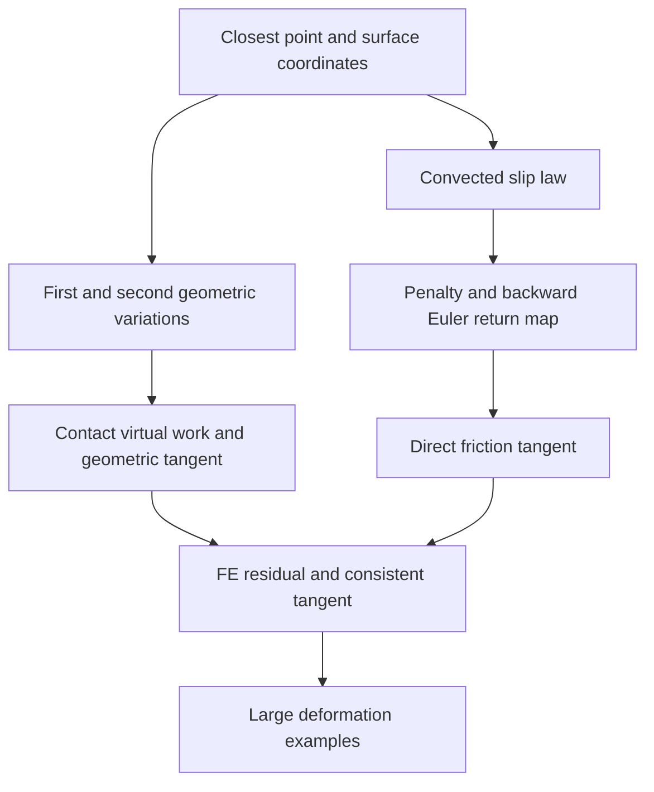

## 1. Paper identity and reading scope

Laursen & Simo (1993), *International Journal for Numerical Methods in Engineering* **36**(20), 3451–3485. [DOI](https://doi.org/10.1002/nme.1620362005) · [Zotero item](zotero://select/library/items/F7CWQ6JC) · [PDF](zotero://open-pdf/library/items/QMNM7NJX).

Read all 35 PDF pages, §§1–5 and references; there are no appended proofs. PDF page 1 corresponds to printed p. 3451. The title/authors match the item. Rendered pp. 3458, 3467 and 3470 were inspected to recover friction-law and tangent formulas lost or rotated in extraction. No citation key was returned by the metadata. This review traces the derivation and numerical evidence; it does not independently verify every long tangent formula or reproduce the calculations.

## 2. Main contribution in plain language

**The paper develops finite-deformation frictional contact at the continuum level, including its geometric derivatives, before choosing finite elements.** Its main idea is to describe slip in coordinates carried by the contacted surface, so rotating and deforming contact geometry can be handled consistently in both friction updates and Newton tangents (§§2–3).

The obstacle is that a contact point moves across another deforming body: its projection, tangent directions, normal and stored frictional components all change. Treating these changes only in an element-specific implementation easily loses geometric terms or imposes restrictions on sliding. The authors build a reusable continuum formulation, then specialize it to three-dimensional brick elements and demonstrate other discretizations. Their priority claims in the introduction are the authors' claims, not independently established here.

## 3. Main results and their scope

**Geometric/constitutive result.** Closest-point geometry and convected surface coordinates give a frame-indifferent frictional description and update (§2.2; Remark 3.4 in §3.2). Frame indifference means a superposed rigid change of observer does not create a different physical friction response; it does not mean Cartesian traction components stay unchanged during a rotation.

**Derived numerical result.** The authors obtain contact virtual work from force balance, linearize the normal and geometric tangential terms in the continuum setting (Eqs. 2.36–2.41), then complete the tangent with the derivative of the chosen backward-Euler friction update (Eq. 3.11). The detailed three-dimensional residual and stiffness are in Eqs. 3.15–3.24.

**Reported solver behavior.** All examples reportedly attain asymptotically quadratic Newton convergence, attributed to consistent linearization, but iteration tables are explicitly omitted (opening of §4, p. 3471). This is reported local nonlinear-solver behavior, not a demonstrated error rate under mesh refinement or a guarantee of global convergence from arbitrary guesses.

**Scope.** Both bodies may deform, and the continuum kinematics are not restricted to small rotations or small relative sliding. However, smooth local surface parametrizations and meaningful closest-point projections are needed (§2.1; §3.3). Finite penalties allow residual penetration and artificial sticking compliance; augmentation is available to improve constraints (§2.3). The paper does not establish existence or uniqueness of the general nonlinear Coulomb problem and explicitly acknowledges the unresolved mathematical setting (§1).

## 4. Method and mathematical setup

The bodies have motions $\varphi^{(1)}$ and $\varphi^{(2)}$. A slave material point $X$ projects onto a master point $\bar Y(X,t)$, represented by surface coordinates $\bar\xi^\alpha$. The paper's $g$ is positive for penetration; $t_N\ge0$ denotes compression. The reference and current surface tangent vectors are $T_\alpha$ and $\tau_\alpha$. Their metrics,

$$M_{\alpha\beta}=T_\alpha\cdot T_\beta,\qquad
m_{\alpha\beta}=\tau_\alpha\cdot\tau_\beta,$$

record how coordinate components translate into physical lengths and angles. A “dual basis” simply pairs with the tangent basis to extract components: $T^\beta\cdot T_\alpha=\delta_\alpha^\beta$ (§2.2.4).

During persistent contact, differentiating the equality of the two contacting spatial positions connects relative material velocity to the rate at which the projection walks across the master surface (Eqs. 2.11–2.13). The friction law is expressed with a convected dual velocity and a traction one-form $t_T^\flat$. The superscript is geometric notation for a covector; the useful intuition is a quantity that pairs with a displacement direction to produce work.

The friction bound is

$$\Phi=\|t_T^\flat\|-\mu t_N\le0,$$

with tangential slip active only at $\Phi=0$ (Eq. 2.18). One local, constant Coulomb coefficient is used, without hardening or static/kinetic distinction. **The reference metric $M$ used in the slip measure is an explicit constitutive choice**, not merely an interchangeable notation for current metric $m$ (Remark 2.3, pp. 3458–3459).

Normal penalty traction is $t_N=\epsilon_N\langle g\rangle_+$. Tangential penalization gives an evolution equation for the convected traction components. Backward Euler produces a trial-stick state followed by return to the pressure-dependent friction bound if necessary (Eqs. 3.8–3.10). Augmentation is imported from the authors' 1992 treatment rather than rederived fully (§2.3).

The contact work pairs normal traction with gap variation and tangential components with projected-coordinate variations (Eq. 2.36). Newton needs derivatives of **both** traction and geometry. That gives a direct friction term, normal stiffness and geometric tangential stiffness. Finite-element quadrature then sums the local contributions. Nodal quadrature with eight-node bricks is the explicit three-dimensional realization; it is not the only discretization allowed by the continuum formula (§3.1–3.3).

## 5. Analysis: what the authors are trying to prove

The authors want to establish a geometrically consistent work statement and tangent that remain usable for two deforming contacting bodies. The main obstacle is that the contact projection itself depends implicitly on both bodies' motion. The work is a derivation paper, **not a collection of lemmas culminating in an existence or convergence theorem**.

| Result (paper label and locator) | Plain-language meaning | Assumptions and earlier results used | Why this step is needed | Where it is used next |
|---|---|---|---|---|
| Eqs. 2.1–2.10 | Define gap, projection and a moving surface basis | Locally smooth surface parametrization, oriented normals | Establishes which points interact and where friction acts | Slip kinematics and variations |
| Eqs. 2.11–2.18; Remarks 2.2–2.3 | Relate relative motion to projection-coordinate rate and state friction objectively | Persistent contact; chain rule; convected dual basis; chosen reference metric | Avoids artificial observer dependence and identifies a slip measure | Penalized law and time update |
| Eqs. 2.25–2.30 | Differentiate gap and solve implicitly for variation of projection coordinates | Orthogonality of projection; both perturbed motions; invertible local geometric system | Includes contact-point migration in virtual work and Newton derivatives | Eq. 2.36 and second variations |
| Eqs. 2.31–2.36 | Derive a single contact-work integral from two-body force balance | Equal/opposite differential contact forces; preceding kinematics | Ensures interface residual comes from mechanics | Linearized work |
| Eqs. 2.37–2.41 | Compute normal and geometric tangential derivatives | Penalty law, first variations, second geometric variations | Prevents omission of geometric stiffness in large sliding | Discrete stiffness; direct friction term still pending |
| Eqs. 3.8–3.11 | Complete traction update and its derivative | Backward Euler, trial/return map, convected components | Supplies the missing direct friction stiffness | Eqs. 3.15–3.24 |
| Eqs. 3.3–3.7 and 3.15–3.24 | Turn continuum work and derivatives into residual and tangent matrices | Chosen element interpolation and quadrature; previous two branches | Makes the method implementable | §4 examples |

The connected argument is: choose a contact pair geometrically; describe sliding in that moving geometry; differentiate the projection as well as the body motion; use equal-and-opposite forces to write work; finally differentiate the constitutive update so Newton sees the same law as the residual. The two derivative branches join only after time integration is chosen. A consistent tangent therefore depends on both geometric and constitutive consistency.

Important qualifications in the paper: the compact work derivation uses the zero-gap contact relation (Remark 2.4), then employs regularized tractions. The Heaviside derivative at $g=0$ is undefined; the implementation chooses a value (p. 3463). The lengthy second variation is stated after algebra rather than expanded step by step (Eq. 2.40). Surface corners invalidate the smooth-basis construction and require practical treatment (§3.3). These details limit a literal reading of “geometrically exact” as a universal smoothness or convergence guarantee.

The normal and purely geometric tangential terms are symmetric; nonsymmetry enters through the direct friction derivative (Remark 2.6). Besides slipping, three-dimensional sticking can contribute nonsymmetry through reference-metric variation at the moving projection. The authors discuss but do not adopt a metric-freezing workaround (p. 3468).

## 6. Experiments and supporting evidence

All examples use finite-strain, rate-independent $J_2$ plasticity in FEAP (§4). They demonstrate a range of configurations rather than providing a systematic error study.

| Example and locator | What it tests | Main observation and evidence limit |
|---|---|---|
| Pan forming, §4.1, Figs. 5–7 | 3D sheet–rigid-tool contact; 800 continuum elements, 100 load steps, $\mu=0.25$ | Forming and large plastic strains are computed. No augmentation is used. The authors note continuum elements are not optimal for bending and corner strains above 100% are partly coarse-mesh artifacts; this is not a validated tearing prediction. |
| Cylinder post-buckling, §4.2, Figs. 8–11 | Axisymmetric finite-strain buckling and self-contact, 177 bilinear elements | Fixture friction ($\mu=0.2$) triggers the first buckle earlier; later cycles approach the frictionless response. Self-contact in the buckle regions is assumed frictionless. Roughly 260/350 steps are reported, not comparable wall-time benchmarks. |
| Interference fit, §4.3, Figs. 12–15 | Two deformable bodies and biquadratic elements, with/without $\mu=0.2$ | Friction increases load, plasticity and material upwelling; four augmentations per step are used. Force oscillations at the taper corner are acknowledged geometric/discrete effects. |
| Copper-rod impact, §4.4, Figs. 16–21 | Dynamic release/contact, coarse 144- and fine 972-element 3D meshes | Frictionless outer-edge separation is captured and suppressed with $\mu=0.25$. Newmark damping removes spurious bouncing, but the chosen dissipative method is only first-order accurate. Computations use 160 steps to 80 microseconds. |
| Cylinder onto deformable rails, §4.5, Figs. 22–24 | Localized 3D frictional impact between deformable bodies | A cylinder initially moving at 80 m/s dents and rebounds; 100 steps reach 2.5 ms with $\mu=0.1$. This is a demanding feasibility example, not an independently validated contact-force history. |

The dynamic study is particularly informative: correct contact constraints alone do not ensure a clean response if the global time integrator excites spurious modes. Damping changes the accuracy/oscillation tradeoff and must be separated from the contact formulation's contribution (§4.4).

## 7. Reviewer’s reflections: value, strengths, and limitations

**Reviewer’s judgement.** This is a high-value formulation paper for understanding how finite sliding, friction history and consistent tangents fit together. Start with §§2.2 and 2.4 before attempting the long brick-element matrices. The continuum-first organization reveals which terms express geometry and which depend on the particular friction update.

The main strengths are the explicit two-body work derivation, the separation of direct and geometric stiffness, and examples spanning element orders, self-contact and dynamics. The paper also makes its constitutive metric choice explicit instead of hiding it in notation (Remark 2.3).

Author-acknowledged limitations are consequential: surface discontinuities remain unresolved in general (§3.3); penalties and augmentation counts require trial and error (§4.1); and Newton convergence tables are not provided (§4). The discrete master/slave bias can be addressed by a two-pass construction, but this is an implementation remedy, not a general stability proof (Remark 3.5).

My main caution is to distinguish three kinds of consistency: geometric objectivity, consistency of the tangent with the implemented residual, and accuracy of the physical/discrete model. None automatically proves the other two. In particular, a convergent Newton solve can still contain finite-penalty constraint errors, corner-induced force oscillations or coarse-mesh strain artifacts—all visible in the paper's own discussion.

For research use, the reusable contribution is the **geometry → work → derivative → discretization** sequence. A new implementation should check frame-indifferent history transport, derivative consistency away from switching events, surface-transition behavior and constraint residuals. Those tests are recommendations, not checks performed in this review.

## 8. Takeaways, questions, and connections

- A moving projection must be differentiated; differentiating body displacement alone misses geometric stiffness.
- Convected coordinates make friction history manageable under finite motion.
- Reference and current metrics are not interchangeable; their choice can be constitutive.
- Quadratic Newton behavior concerns an inner nonlinear solve, not FE accuracy.
- Surface corners and time-integration artifacts remain important even with a sophisticated tangent.

Second reading: Why is the reference-metric slip measure appropriate for your interface physics? What happens when a projection crosses an element edge? Which terms can be verified by directional finite differences before assembling the full matrix?

| Source | Relation | Target | Evidence locator | Status |
|---|---|---|---|---|
| This paper | uses | [Simo and Laursen (1992) - Augmented Lagrangian friction](Simo%20and%20Laursen%20%281992%29%20-%20Augmented%20Lagrangian%20friction.md) augmented Lagrangian friction algorithm | §2.3; reference 25 | Explicit citation and imported algorithm |
| This paper | discusses | [Simo et al. (1985) - Perturbed Lagrangian contact](Simo%20et%20al.%20%281985%29%20-%20Perturbed%20Lagrangian%20contact.md) contact-segment integration | Remark 3.2; reference 22 | Explicit citation; different quadrature choice |
| Convected kinematics | supports | Frame-indifferent friction update | §§2.2, 3.2 | Derived/explained in paper |
| Exact geometric derivatives | supports | Consistent Newton tangent | Eqs. 2.25–2.41; 3.11 | Derived in paper |

[Back to the contact mechanics reading map](Contact%20Mechanics%20-%20Review%20Index.md)
