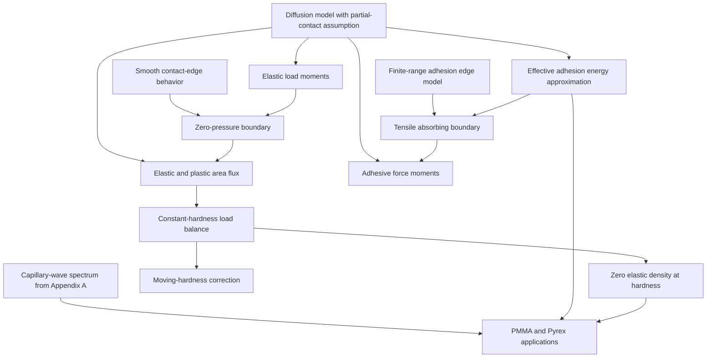

## 1. Paper identity and reading scope

**B. N. J. Persson (2006), “Contact mechanics for randomly rough surfaces.”** Zotero identifies the journal article in *Surface Science Reports* 61(4), 201–227, [DOI](https://doi.org/10.1016/j.surfrep.2006.04.001). [Zotero item](zotero://select/library/items/9KX68UXT), personal library 3933681.

**Version matters:** although its filename contains the journal DOI, attachment **92R7KM76** is the 29-page **arXiv:cond-mat/0603807v1, March 30, 2006**. Title and author match. Read all pages, Sections 1–13 and Appendices A–B, including references. All page locators below are **PDF pages of this preprint**, not journal pages. The published version was not fetched or compared. The rendered page 8 was checked because extraction of Eqs. (20)–(21) was ambiguous; apparent inconsistencies remain in the source itself. Complete reading does not mean complete independent verification.

## 2. Main contribution in plain language

The central idea is to describe rough contact by **how its stress distribution changes as progressively finer roughness becomes visible**, rather than adding many isolated Hertz contacts. This article reviews that earlier theory and contributes a detailed account of its stress-distribution boundary conditions for elastic, plastic and adhesive contact, together with an improved energy approximation and applications (Introduction; Sections 4–10).

At low magnification a patch looks fully touching; at higher magnification it breaks into smaller contacts and gaps. The theory turns that picture into a diffusion-like equation in **stress and magnification**. Its special value is connecting a measurable surface spectrum to contact area, stress, adhesion and yielding across many length scales. It is a statistical continuum model, not a resolved finite-element calculation of each asperity.

## 3. Main results and their scope

**Baseline model prediction.** For nonadhesive elastic contact, the theory predicts contact area proportional to applied load when real area is a small fraction of nominal area; at higher load it approaches full contact continuously (Section 3.4). In Eq. (22),

$$A=\alpha F_N,\qquad
\alpha=\sqrt{\frac8\pi}\,\frac{1-\nu^2}{E}
\left[\int d^2q\,q^2C(q)\right]^{-1/2}.$$

Here $C(q)$ is the isotropic roughness power spectrum, $E/(1-\nu^2)$ the combined effective stiffness in the paper’s convention, and $F_N$ the applied force. The integral measures slope-scale roughness. This proportionality is a low-area/load result, not an all-load law or a complete microscopic friction law.

**New analytical discussion in this article:**

- Nonadhesive elastic stress density vanishes at zero pressure: $P(0,\zeta)=0$ (Section 4).
- For the ideal constant-hardness plastic extension, the *elastic* stress density also vanishes at the yield boundary: $P(\sigma_Y,\zeta)=0$; lost probability/area flows into a separate plastically yielded area (Section 6).
- When hardness varies with scale, the boundary condition changes and need not have that zero value (Eqs. (33)–(34), Section 7).
- Adhesive contact admits tension down to $-\sigma_a(\zeta)$, with $P(-\sigma_a,\zeta)=0$ justified through local detachment-edge behavior (Section 8.1 and Appendix B).
- The effective adhesion energy balances microscopic binding energy against stored elastic energy, Eq. (37); Section 8.2 proposes an improved weighting of the latter. This is an approximate closure, not an exact full partial-contact solution.

**Scope and evidence boundary.** Eq. (17) is derived for complete contact in earlier work and **assumed locally applicable to partial contact** here (p. 8). Boundary consistency does not prove that this extrapolation is exact. The paper gives theory-generated curves, comparisons with earlier numerical studies and interpretations of existing experiments; it contains no general theorem establishing accuracy for all rough surfaces, constitutive laws or loads. Isotropic statistical roughness, adequate scale cutoffs, and the validity of continuum/constitutive approximations are central.

## 4. Method and mathematical setup

| Symbol | Meaning |
|---|---|
| $A_0$, $A(\zeta)$ | Nominal area and apparent contact area at magnification $\zeta$ |
| $\zeta$ | Resolution parameter: finer roughness is included as it increases; not physical time |
| $q$, $C(q)$ | Spatial wave number and isotropic height power spectrum |
| $\sigma_0=F_N/A_0$ | Nominal applied compressive pressure |
| $P(\sigma,\zeta)$ | Stress density normalized by nominal area; its integral equals contact fraction, not necessarily 1 |
| $\sigma_Y$, $\sigma_a$ | Plastic hardness threshold and tensile detachment magnitude |
| $\gamma_{\mathrm{eff}}$ | Effective adhesion energy after accounting for roughness and elastic energy |

The governing statistical equation and its coefficient are Eqs. (17)–(18):

$$\frac{\partial P}{\partial\zeta}
=f(\zeta)\frac{\partial^2P}{\partial\sigma^2},\qquad
f(\zeta)=\frac\pi4\left(\frac{E}{1-\nu^2}\right)^2q_Lq^3C(q),
\quad q=\zeta q_L.$$

At the coarsest resolution $P(\sigma,1)=\delta(\sigma-\sigma_0)$: all nominal area initially carries the same stress (Eq. (19)). Revealing roughness broadens the distribution. At zero stress, nonadhesive area exits contact; at hardness, it becomes plastic contact. A boundary thus has a direct physical interpretation rather than being chosen merely to solve the equation.

For a clean equivalent statement of the nonadhesive solution, define **reviewer-normalized** $S(\zeta)=\int_1^\zeta f(s)\,ds$. Solving the absorbing-boundary diffusion problem gives

$$\frac{A(\zeta)}{A_0}=\operatorname{erf}\left(\frac{\sigma_0}{2\sqrt{S(\zeta)}}\right).$$

This follows from Eqs. (17)–(19) and the zero-stress boundary, and expresses the intended error-function result of Eq. (20). **Source caution:** the displayed integral limit and normalization in preprint Eqs. (20)–(21) are inconsistent with that diffusion coefficient and with the neighboring error-function expression. The formula above is explicitly a normalized reconstruction, not a silent transcription. Implementers should derive it from $f$ or check the published version.

For adhesion, the physical energy balance is

$$A^*(\zeta)\gamma_{\mathrm{eff}}(\zeta)
=A^*(\zeta_1)\Delta\gamma-U_{\mathrm{el}}(\zeta)$$

(Eq. (37)); $A^*$ is actual surface area, distinct from projected area $A$. Elastic deformation costs some of the binding energy. Consequently, considerable microscopic contact need not imply measurable macroscopic pull-off adhesion (Figs. 18–20).

## 5. Analysis: what the authors are trying to prove

The authors want boundary conditions that conserve the physically correct quantities as resolution changes. The main obstacle is that **contact area, load carried inside contact, and external load are not interchangeable**, especially with plasticity or attractive forces outside contact. There are no named lemmas/theorems. The following dependency map follows the equation-level arguments and keeps the branches distinct.

| Result (paper label and locator) | Plain-language meaning | Assumptions and earlier results used | Why this step is needed | Where it is used next |
|---|---|---|---|---|
| Diffusion model (17)–(19), p. 8 | Roughness progressively broadens stress | Earlier complete-contact theory [9]; assumed extension to partial contact | Provides evolution needing boundary conditions | Sections 4, 6–9 |
| Hertz example (23), Section 4, p. 11 | Pressure density tends linearly to zero at the contact edge | Imported smooth elastic contact-edge behavior | Gives a local physical reason for the absorbing boundary | $P(0,\zeta)=0$ |
| Load moments (24)–(25), p. 11 | Nonzero density at zero would change total supported load in the diffusion model | (17), integration by parts, decay at high stress, fixed external load | Independent consistency argument for zero boundary | Elastic area flux (26), Eq. (20) solution |
| Area flux (27)–(29), pp. 12–13 | Elastic area exits toward separation or plastic yielding | (17), elastic zero boundary; ideal plastic threshold | Accounts for all area without losing yielded contact | Plastic force balance |
| Load balance (30)–(32), p. 13 | A nonzero elastic density at constant hardness would violate total load balance | Yielded region carries $\sigma_YA_{\mathrm{pl}}$; constant $\sigma_Y$ | Derives $P(\sigma_Y,\zeta)=0$ | Constant-hardness model, Fig. 15 |
| Moving-hardness formulas (33)–(34), p. 13 | A changing threshold adds boundary/force terms | Scale-dependent $\sigma_Y(\zeta)$; previous moment balance | Prevents incorrectly reusing the constant-hardness boundary | Size-dependent extension |
| Adhesion energy/threshold (36)–(37), p. 14 | Crack-scale adhesion competes with elastic energy | Imported crack scaling; effective-energy approximation | Defines tensile threshold and its scale dependence | Adhesive diffusion boundary |
| Adhesive moments (38)–(42), pp. 14–15 | Contact-region load can exceed external load because outside regions attract | Moving tensile threshold; (17) | Explains why elastic load-conservation argument cannot set adhesive boundary | Physical interpretation of adhesion load |
| Detachment-edge argument, p. 15; Appendix B, p. 28 | Stress density vanishes linearly as detachment stress is approached | Finite-range cohesive/process-zone picture; imported Greenwood–Johnson construction | Supplies $P(-\sigma_a,\zeta)=0$ through local geometry | Adhesive contact calculation |
| Elastic-energy refinement (43)–(50), p. 16 | Weight elastic energy by stress fluctuations, not only area | Diffusion moment equations and an approximate energy closure | Reduces overcounting energy in regions that detached | Figs. 18–20 and applications |
| Appendix A (A1)–(A4), p. 27 | Thermal surface waves yield a roughness spectrum | Quadratic small-slope energy, Fourier modes, classical equipartition | Supplies spectrum for cooled glassy surfaces | PMMA/Pyrex examples |

The elastic proof is accessible: multiply the diffusion equation by stress and integrate. The result says total supported load changes in proportion to $P(0,\zeta)$. Since changing your microscope cannot change the applied load, that boundary value must vanish within the model. Plasticity repeats this bookkeeping while remembering that yielded contact still carries force.

Adhesion is the important exception: noncontacting surfaces also attract, so force carried *within* contact may rise with magnification while total external force stays fixed. The proof therefore changes to a local detachment-edge argument rather than reusing the wrong conservation law. Appendix B illustrates it with the difference of two Hertz pressure distributions and a finite attractive annulus.

**Auxiliary branches:** Section 5 proposes a depth-averaged, scale-dependent modulus for graded solids; Section 8.4 supplies a short-scale stress interpolation; Sections 8.5–8.7 discuss flaw tolerance, viscoelasticity and biological structures. These are estimates/discussions, not required lemmas of the elastic result. Section 9 combines adhesion and plasticity by a change of variables and sine expansion, Eq. (52), but explicitly **defers detailed derivation and numerical results** to another publication (p. 21). This review does not fill that gap with invented analysis.

## 6. Experiments and supporting evidence

**Baseline contact comparisons (Section 3.5, Fig. 11).** Earlier finite-element and molecular-dynamics results support approximately linear low-load contact area, but not exact agreement in its coefficient. The text reports values approximately 13–14% above the theory for some simulations and about 20% below for another discretized continuum result (pp. 9–10). The author attributes differences partly to discretization/contact-area definitions. These are reported prior results, not independent reproductions here.

**Model illustrations (Figs. 10, 15, 18–20).** Elastic area decreases as finer roughness is resolved; constant-hardness yielded area approaches its load/hardness scale. In the tire-rim-inspired example, $E=10$ MPa, $\nu=0.5$, $\Delta\gamma=0.05$ J/m² and nominal pressure 0.5 MPa, adhesion raises the computed contact fraction from about 0.06 to 0.44 (p. 18). These are parameterized predictions, not tire tests. The no-leakage inference also assumes a particular percolation picture; area fraction alone is not a measured leak rate.

**PMMA friction interpretation (Section 10.1, Fig. 23).** Frozen-capillary roughness is used to calculate contact area and relate it to nominal shear stress through a locally constant shear-strength assumption. For TMS, the 50 MPa shear strength is inferred from prior multicontact data; for OTS, **5 MPa is chosen for agreement**, and an independent multicontact test is proposed. The crossover wave number was not measured for PMMA. The agreement is suggestive, not a parameter-free validation of the proposed explanation.

**Pyrex adhesion (Section 10.2, Figs. 24–28).** Earlier experiments use a 1.8 mm sphere in dodecane to suppress capillary bridges and observe adhesion after sufficient squeezing. The paper explains this through plastic flattening of short-scale roughness plus reduced stored elastic energy. The model’s smoothed spectrum applies smoothing more broadly than the actual localized asperity flattening; the author discusses that difference on pp. 24–25. This provides a plausible mechanism for preload-dependent adhesion, not a resolved simulation of the entire loading cycle.

**Numerical-testing discussion (Section 12, Fig. 30).** The article emphasizes resolving the smallest contact patch, not merely the shortest roughness wavelength, when measuring area/stress distributions. Its comments on available computing capabilities describe 2006, not present-day limits.

## 7. Reviewer’s reflections: value, strengths, and limitations

**Reviewer’s judgement.** The strongest educational contribution is the conservation-based explanation of boundary conditions. It gives each mathematical boundary a physical job. The careful distinction between external load and force within adhesive contact is especially valuable and links directly to why attraction outside contact matters in sphere–plane models.

The model is attractive because a spectrum encodes roughness over many scales without resolving every contact. But that convenience comes from a closure assumption: the complete-contact diffusion law is extended to partial contact (p. 8). Exactness at full contact and correct boundary behavior do not alone establish uniform accuracy in partial contact. The author’s favorable interpretation of comparison data should remain separate from the actual discrepancies reported in Section 3.5.

A spectrum is a statistical descriptor, and the random-phase construction in Section 2 supports that intended scope. **Reviewer inference:** surfaces with strong spatial organization, anisotropy or preparation-induced correlations beyond this representation need separate scrutiny. Likewise, continuum/ideal-hardness assumptions near atomic scales are material-dependent, despite the usefulness of scale-based reasoning; Sections 8.4 and 11 themselves discuss that boundary.

The applications are strongest as mechanism proposals. PMMA has an unmeasured spectral crossover and a fitted OTS strength; Pyrex uses a heuristic smoothing operation (Section 10). These limitations matter when estimating predictive uncertainty. The paper’s own frank statements about incomplete viscoelastic adhesion theory and deferred elastoplastic-adhesion results are useful boundaries, not details to hide.

For implementation, the supplied preprint has enough formula inconsistencies to justify checking equations from their preceding derivations. The Eq. (20)–(21) issue is visible in the original page, so it is not merely bad text extraction. I recommend using this article first for the conceptual/statistical framework and boundary-condition reasoning, then verifying the exact chosen model equations and assumptions before coding quantitative predictions.

## 8. Takeaways, questions, and connections

- Contact area depends on observation scale; roughness amplitude alone is inadequate.
- Boundary conditions express force/area bookkeeping and local detachment physics.
- Plastic area remains load-bearing even after leaving the elastic stress distribution.
- Microscopic adhesion can enlarge contact while macroscopic pull-off adhesion vanishes.
- Model-generated curves, fitted experimental interpretations and exact limiting arguments have different evidential weight.

Second-reading questions: What roughness cutoffs dominate your predicted area? Is the contact sufficiently resolved to test the zero-stress limit? Which parameters are measured rather than fitted? Are you predicting contact area, pull-off force, friction, or leakage—and what additional assumptions connect those quantities?

| Source | Relation | Target | Evidence locator | Status |
|---|---|---|---|---|
| Present article | extends | Persson 2001/2002 statistical contact theory | Introduction; references [9]–[10] | Author-stated; prior papers not separately read |
| Baseline prediction | compares-with | Greenwood–Williamson and Bush–Gibson–Thomas | Sections 3.2–3.5 | Explicit comparison |
| Adhesive boundary discussion | uses | Greenwood–Johnson finite-range sphere model | Section 8.1, Appendix B, reference [30] | Explicit |
| Adhesive load accounting | connects-to | Outside-contact attraction in DMT review | Sections 8.1, 10.2; [DMT review](Derjaguin%20et%20al.%20%281975%29%20-%20Adhesive%20particle%20contact.md) | Reviewer-inferred conceptual link; not a claim that this paper cites DMT 1975 |
| Frozen-capillary spectrum | explains | Proposed PMMA/Pyrex mechanisms | Appendix A; Section 10 | Author interpretation with noted calibration/model limitations |

[Back to the contact mechanics reading map](Contact%20Mechanics%20-%20Review%20Index.md)
