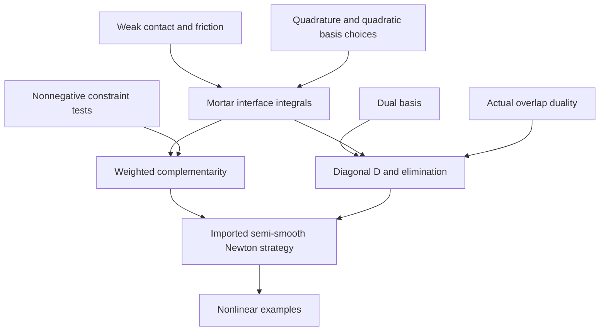

## 1. Paper identity and reading scope

**Popp and Wall (2014), GAMM-Mitteilungen 37(1), 66–84.** [DOI](https://doi.org/10.1002/gamm.201410004); [Zotero item](zotero://select/library/items/4ETI593A), personal library 3933681.

Read all 19 pages of attachment **MUWTB2GM**, Sections 1–6 and references. Printed page = PDF page + 65. This is an overview article that explicitly condenses earlier publications [34–39]; full technical derivations and several example specifications are deferred to those works (p. 67). They were not retrieved. Complete review of the supplied article does not imply access to those underlying proofs or independent verification of all claims.

## 2. Main contribution in plain language

This paper makes the case for an integrated **dual-mortar contact framework**: enforce contact over surface patches, choose contact-force basis functions that make multiplier elimination cheap, and solve geometry, material response and contact-state changes within one Newton-type loop. Its main value is explaining how those pieces fit together and where practical robustness fails (Sections 2–5).

It is a synthesis with illustrative developments rather than one new theorem. The distinct developments are corrected biorthogonality for partial overlaps, Petrov–Galerkin gap testing, economical integration, quadratic interpolation, and joint plasticity/contact active-set treatment.

## 3. Main results and their scope

**Algebraic/structural:** dual multiplier functions make the slave-side mortar matrix $D$ diagonal (Eqs. (17), (20), p. 71), enabling elimination of contact multiplier unknowns. Contact constraints become complementarity conditions on **weighted gaps**, not raw pointwise gaps (Eqs. (23)–(24)). This does not guarantee pointwise nonpenetration at every point of an approximate surface.

**Reported mathematical properties:** optimal approximation and active-set/semi-smooth-Newton equivalence are credited to earlier literature (pp. 66–67, 73). No full proof of general nonlinear well-posedness or convergence is given here. Quadratic local Newton convergence is described once the active set is fixed and consistent linearization applies; it is not global convergence from any initial guess.

**Numerical findings:** partial-overlap patch test passes to machine precision (p. 75); Petrov–Galerkin weighting eliminates an observed active-set cycle in the tori impact case (Table 1); inexpensive element integration closely matches a more accurate integration reference for that example (Fig. 4); quadratic elements exhibit an approximately $O(h^{3/2})$ energy-error rate under uniform refinement in a Hertz-type problem (Fig. 6). These test-specific results should not be generalized into unconditional guarantees.

## 4. Method and mathematical setup

The displacement fields solve finite-deformation solid mechanics. A contact multiplier represents minus the contact traction on the chosen slave side, so its normal component is nonnegative in compression, whereas physical normal pressure $p_n$ is nonpositive (Section 2).

For continuous contact, $g_n\ge0$, $p_n\le0$, and $p_ng_n=0$: either there is a positive gap and no compression, or compression and a closed gap. Coulomb friction bounds tangential traction by friction coefficient times normal-pressure magnitude (Eqs. (6)–(7)).

Mortar discretization tests these conditions through an interface integral. With multiplier functions $\Phi_j$ and displacement functions $N_k$, the key algebra is

$$D_{jk}=\int_{\gamma_c^{(1)}}\Phi_jN_k^{(1)}\,dA,
\qquad M_{jl}=\int_{\gamma_c^{(1)}}\Phi_j(N_l^{(2)}\circ\chi_h)\,dA,$$

$$\widetilde g_{n,j}=\int_{\gamma_c^{(1)}}\Phi_jg_{n,h}\,dA,
\qquad \widetilde g_{n,j}\ge0,\quad \lambda_{n,j}\ge0,\quad
\widetilde g_{n,j}\lambda_{n,j}=0.$$

These are scalar versions of Eqs. (20)–(24). $\chi_h$ maps points between contacting surfaces. **Biorthogonality** means different multiplier/displacement basis functions integrate to zero against each other on the slave side; only matching indices survive. That is what makes $D$ diagonal. $M$ still couples nonmatching meshes and is not diagonal in general.

An active set decides which contact constraints are currently binding. A semi-smooth Newton method solves an equivalent nonsmooth equality formulation while updating that set (Section 4). “Semi-smooth” permits the branch changes associated with opening, sticking and sliding. It does not eliminate the need for careful derivatives or a suitable linear solver.

## 5. Analysis: what the authors are trying to prove

The authors want a formulation that preserves the advantages of variational contact while remaining implementable and robust at finite deformation. The obstacles are nonmatching surfaces, changing contact status, sign-changing multiplier functions, partial overlaps and expensive integration. There is **no lemma-to-theorem proof sequence in this overview**. The table records its actual formulation and evidence dependencies, identifying imported claims.

| Result (paper label and locator) | Plain-language meaning | Assumptions and earlier results used | Why this step is needed | Where it is used next |
|---|---|---|---|---|
| Eqs. (6)–(14), pp. 68–69 | Contact and friction are expressed as weak constraints and interface work | Solid mechanics; trace/duality spaces; equivalence deferred to [40] | Defines what the discrete method approximates | Mortar discretization |
| Eqs. (17)–(22), pp. 70–71 | Duality diagonalizes $D$ | Suitable multiplier space and matching integration domain | Enables cheap multiplier elimination | Global solution algorithm |
| Eqs. (23)–(28), pp. 71–72 | Weighted-gap conditions form discrete complementarity | Weak constraints; discrete equivalence attributed to [40] | Identifies contact-state unknowns | Section 4 active-set algorithm |
| Section 4, p. 73 | Active-set iteration is interpreted as semi-smooth Newton | Imported NCP/optimization results; consistent linearization | Combines nonlinearities in one loop | All nonlinear examples |
| Section 5.1, pp. 73–75 | Define biorthogonality on actual overlap | Earlier dual construction; partially integrated elements | Prevents loss of diagonal $D$ | Patch test Fig. 2 |
| Eq. (29), Section 5.2, pp. 75–77 | Use dual trial multipliers but nonnegative standard constraint tests | First-order shape functions | Prevents positive physical gap becoming negative weighted gap | Tori active-set test, Table 1 |
| Section 5.3, pp. 77–79 | Compare exact overlap segmentation with cheaper element quadrature | Mortar integrals over nonmatching supports | Evaluates cost/accuracy tradeoff | Fig. 4 |
| Section 5.4, pp. 79–80 | Change basis for problematic quadratic facets | Nonzero/positive integrals required for duality; proofs in [37–38] | Makes higher-order dual contact viable | Energy-error test Fig. 6 |
| Section 5.5, pp. 80–82 | Plasticity and contact share one active-set solve | Finite-strain plasticity, extra locally eliminable unknowns | Avoids solving plastic constraints fully inside every global iteration | Figs. 7–8 |

The logic is: make interface forces consistent with virtual work; choose a basis that simplifies their algebra; express open/closed and stick/slip states as complementarity; then address situations where the discretization can fool that state logic. The Petrov–Galerkin step is especially intuitive: averaging an everywhere-positive gap with negative weights can produce a negative result, so change the test weights. This improvement costs symmetry of the linearized matrix even without friction (p. 76).

## 6. Experiments and supporting evidence

- **Partial-overlap patch test, Fig. 2 (pp. 74–75):** constant pressure $p=-0.1$, neo-Hookean blocks, $E=100$, $\nu=0$. Choosing the lower block as slave deliberately creates partial integration. Constant stress transmission to machine precision tests consistency, not every aspect of robustness.
- **Tori impact, Fig. 3 and Table 1 (pp. 76–77):** 23,340 linear hexahedral elements, generalized-$\alpha$ time integration. At $t=3.20$, ordinary dual testing alternates active sets with residuals around 181 and 270, while Petrov–Galerkin reaches $2.219\times10^{-8}$ in five iterations. This directly illustrates the identified failure mechanism.
- **Quadrature, Fig. 4 (pp. 78–79):** displacement norm is compared with segment integration using 12 Gauss points per cell. Four-point element integration uses about 7% of the integration time of seven-point segment integration in this example. This is **integration time**, not a 14-fold overall application speedup; the shown displacement error also does not measure every local contact stress.
- **Hertz-type half-ellipsoid, Figs. 5–6 (pp. 79–80):** compare hex8 and hex20 under uniform refinement; the energy norm measures strain-error energy, Eq. (30), with a fine hex20 reference displacement solution. Observed quadratic-element rate is about $h^{3/2}$; regularity near contact boundaries constrains attainable rates.
- **Elastoplastic tube compression, Figs. 7–8 (pp. 81–82):** 40 load steps, local superlinear convergence after active sets are found. Authors explicitly note unusually large hardening moduli and elastic dominance permit the large steps. This is an important qualification of the robustness demonstration.

## 7. Reviewer’s reflections: value, strengths, and limitations

**Reviewer’s judgement.** This is an excellent first map of computational dual mortar contact because it connects variational ideas to concrete failure modes. The partial-overlap and signed-weight examples are more instructive than an unqualified claim that a method is robust. For your interest in solvers, the paper also makes clear why local multiplier condensation is attractive without pretending the remaining system is easy (Section 6).

The costs are explicit: geometry-dependent coupling must be repeatedly integrated and consistently differentiated (p. 72); partial integration can cause conditioning difficulties (p. 75); Petrov–Galerkin requires nonsymmetric solvers (p. 76). Diagonal $D$ is an algebraic advantage, not an overall complexity guarantee.

As an overview, it deliberately omits full algorithms, proofs and some example inputs. That is not a defect in its purpose, but it limits standalone reproducibility and prevents using this PDF alone as a rigorous proof reference. A priori error estimates and Newton convergence theory should be cited to the underlying sources, not claimed as new proofs here.

The quadrature result is promising but uses a global displacement metric in one dynamic example. **Reviewer inference:** a production choice should also test local pressure and constraint errors, especially near edges, before assuming the same savings. Similarly, the elastoplastic example’s high hardening limits how much it establishes about harder plasticity regimes.

## 8. Takeaways, questions, and connections

- Dual mortar means weak interface coupling plus a biorthogonal force basis.
- Weighted-gap positivity and diagonal coupling are separate design requirements.
- Active-set/Newton convergence is different from mesh convergence.
- Condensation helps, but appropriate linear solvers remain an open challenge in this article.

Second-reading questions: Which integration domain defines your dual basis? Can your gap weights change sign? What symmetry does the resulting tangent actually possess? Which contact quantity should control quadrature accuracy?

| Source | Relation | Target | Evidence locator | Status |
|---|---|---|---|---|
| Dual mortar | uses | Biorthogonal Lagrange multipliers | Eqs. (17)–(22) | Explicit |
| Contact solve | uses | Semi-smooth Newton / primal-dual active sets | Section 4 | Imported theory summarized |
| Petrov–Galerkin variant | modifies | Constraint test space | Eq. (29) | Explicit |
| Overview | motivates | Isogeometric surface discretization | Section 6 | Author outlook; connection to Seitz 2016 is reviewer-inferred |

[Back to the contact mechanics reading map](Contact%20Mechanics%20-%20Review%20Index.md)
