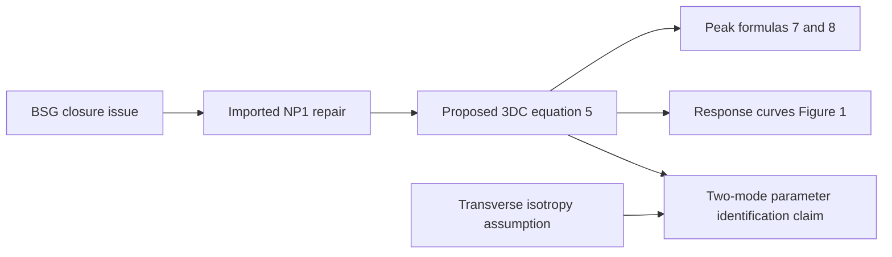

## 1. Paper identity and reading scope

**Salehani and Irani (2018), arXiv preprint, “A coupled mixed-mode cohesive zone model: An extension to three-dimensional contact problems.”** [Zotero item](zotero://select/library/items/4C7ZBFV4), personal library 3933681; [source record](https://arxiv.org/abs/1801.03430).

Read all five PDF pages, Sections 1–4 and references, of attachment **VMP3K22X**; checked the rendered model equation on page 3. PDF and printed page numbers coincide. The margin identifies v1 dated January 10, 2018, while the title block says November 8, 2018; that inconsistency is recorded without assuming a later published version. No external papers or supplements were retrieved. This is a source-grounded review, not a full independent verification.

## 2. Main contribution in plain language

The paper proposes a compact **three-dimensional traction–separation law** in which opening or sliding in any direction changes the forces in the other directions. Its particular goal is to handle **compression combined with sliding**, where some earlier cohesive laws can predict an unphysical reversal of tangential resistance (Sections 2–3).

The contribution is a constitutive-model proposal extending the two-dimensional NP1 law described in Section 2. It is not a new finite-element method or a convergence theorem. Its appeal is that the same smooth formula covers normal and two tangential gaps and distinguishes normal compression from separation.

## 3. Main results and their scope

- **Proposed result:** Eq. (5) defines the 3DC law. With positive model parameters, the tangential traction has the sign of tangential gap, and compression increases its amplitude at fixed tangential gaps. The offending factor $1+\Delta_1/\delta_1$ from BSG Eq. (2) has been removed through the NP1 construction (pp. 2–3).
- **Algebraic result:** holding the other gaps fixed, positive normal traction peaks at $\Delta_1=\delta_1$, and positive tangential traction peaks at $\Delta_i=\delta_i/\sqrt{2}$ for $i=2,3$. Eqs. (7)–(8) give the corresponding coupled and uncoupled peak strengths (pp. 3–4).
- **Scope:** the working three-dimensional model uses transverse isotropy, $\phi_2=\phi_3$ and $\delta_2=\delta_3$, Eq. (6). General anisotropy is explicitly outside scope (p. 4).
- **Evidence boundary:** there are no material experiments, finite-element benchmarks, existence results, error estimates, or general thermodynamic admissibility proof. Section 4 explicitly requests further experimental and computational verification. Claims of physically realistic behavior should therefore be read as a claim about selected constitutive responses, not validation for arbitrary contact histories.

## 4. Method and mathematical setup

A cohesive law replaces an ideal perfectly bonded interface by forces depending on relative displacement. Here $T_i$ is interface traction, $\Delta_i$ is the displacement jump, $\delta_i>0$ a characteristic gap, and $\phi_i$ an amplitude parameter described by the authors as work of separation. Direction 1 is normal; directions 2 and 3 are tangential. Positive $\Delta_1$ opens the interface; negative $\Delta_1$ represents overclosure.

Writing Eq. (5) explicitly in three dimensions, without changing its parameters,

$$
T_i=\frac{\phi_i\Delta_i}{\delta_i^2}
\exp\left[-\frac{\Delta_1}{\delta_1}
-\left(\frac{\Delta_2}{\delta_2}\right)^2
-\left(\frac{\Delta_3}{\delta_3}\right)^2\right],\qquad i=1,2,3.
$$

The **shared exponential is the coupling**: changing one gap scales all three tractions. The normal gap enters linearly in the exponent, allowing compression to strengthen resistance; the tangential gaps enter quadratically, treating positive and negative sliding symmetrically.

The uncoupled peak values in Eq. (8) are $\phi_1/(e\delta_1)$ and $\phi_i/(\sqrt{2e}\,\delta_i)$ for a tangential direction. These are strengths, not fracture energies. One should distinguish their units: traction is force per area, while integrated traction times gap is energy per area.

## 5. Analysis: what the authors are trying to prove

The authors want to show that a simple 3D extension retains the desired separation response while eliminating an undesirable tangential response during compression. Their obstacle is **the shape of the constitutive law**, not a difficult functional-analysis proof. There are no labelled lemmas or theorems; the following is the equation-and-argument chain actually present.

| Result (paper label and locator) | Plain-language meaning | Assumptions and earlier results used | Why this step is needed | Where it is used next |
|---|---|---|---|---|
| BSG Eq. (2), Section 2, p. 2 | Tangential prefactor becomes negative when normal overclosure exceeds $\delta_1$ | Earlier model and positive interface parameters | Identifies the specific response to repair | NP1 motivation |
| NP1 Eq. (3), p. 2 | Removing that prefactor avoids the sign reversal | Imported McGarry et al. model, reference [13] | Supplies the two-dimensional starting point | Section 3 construction |
| 3DC Eq. (5), p. 3 | All three gaps enter each traction, with separate normal/tangential behavior | Phenomenological extension of NP1 | Defines the proposed model | Eqs. (7)–(8), Fig. 1 |
| Transverse isotropy Eq. (6), p. 3 | Two tangential directions share material parameters | Modelling assumption, not a proved result | Limits the required independent tangential calibration | Claimed mode-I/mode-II identification |
| Peak formulas Eqs. (7)–(8), pp. 3–4 | Locate and scale the traction peaks | Eq. (5), other gaps held fixed | Makes parameter interpretation and response shape explicit | Fig. 1 |
| Section 4, p. 4 | Model is a platform needing further validation | Above construction and plots | Marks the boundary of the conclusion | Future simulations/experiments |

In plain language: first find the factor that causes an unwanted sign change; use an existing repair; make the repaired exponential depend on a second tangential gap; then examine maxima and response curves. No abstract norm, coercivity argument, or lemma hierarchy is hidden here. The step from sensible curves to reliable material predictions remains unperformed.

## 6. Experiments and supporting evidence

**Figure 1 (p. 4) plots the law itself.** It illustrates how other gaps lower normal or tangential peak tractions, and shows the tangential peak at normalized gap $1/\sqrt{2}$. These curves are constitutive illustrations, not independent measurements or numerical solution of a contact boundary-value problem. No fit, error bars, mesh study, timing, or experimental baseline is supplied. Mode-I and mode-II calibration is proposed but not carried out (Sections 3–4).

## 7. Reviewer’s reflections: value, strengths, and limitations

**Reviewer’s judgement.** This is useful as a short, understandable example of how a constitutive model is constructed by diagnosing a specific failure mode. The formulas are compact, smooth, and easy to implement, and the paper clearly acknowledges that validation is still needed (Section 4).

A concrete implementation concern is the meaning of $\phi_i$. **Reviewer-derived check:** integrating the printed Eq. (5) along an uncoupled positive tangential path gives

$$
\int_0^\infty T_i\,d\Delta_i=\frac{\phi_i}{2},\qquad i=2,3,
$$

whereas normal opening gives $\phi_1$. Eq. (3) has a tangential factor 2 that Eq. (5) does not. The authors say the 2D restriction “almost” coincides with NP1, but do not explain the resulting energy normalization (p. 3). This is a real ambiguity for calibration if $\phi_t$ is entered as measured work of separation; it does not invalidate the peak formulas for the law as printed.

A second **reviewer-inferred limitation** is that all tractions, including normal compressive resistance at a fixed negative normal gap, tend toward zero under very large tangential gaps because of the shared exponential. That follows directly from Eq. (5). Whether this is acceptable depends on whether the law is used alone or combined with a separate nonpenetration/contact treatment. Such a treatment and unloading/history rules are not specified here. The law should not automatically be treated as a complete general friction/contact algorithm.

I would learn the model-design argument and use it as a candidate for controlled constitutive tests. Before research deployment I would settle the energy normalization, define loading/unloading and contact enforcement, and test mixed-mode paths; the paper itself supplies no evidence resolving those issues.

## 8. Takeaways, questions, and connections

- The contribution is a 3D coupled **constitutive law**, with compression response as its central motivation.
- The main argument is algebraic construction and curve inspection, not a lemma-to-theorem proof.
- Transverse isotropy matters to the two-mode calibration claim.
- Clarify tangential work normalization and large-slip compression behavior before implementing it.

Second-reading questions: Is measured mode-II energy represented by $\phi_t$ or $\phi_t/2$? What additional contact/history law is intended after complete tangential decohesion? Which loading paths would distinguish this model from NP1 or an effective-gap law?

| Source | Relation | Target | Evidence locator | Status |
|---|---|---|---|---|
| 3DC | extends | McGarry et al. NP1 formulation | Section 3; Eq. (3) to Eq. (5); reference [13] | Author-stated; cited source not independently read |
| 3DC | compares-with | BSG cohesive law | Section 2, Eqs. (2)–(3) | Author-stated |
| 3DC | uses | Transverse isotropy | Eq. (6) | Explicit assumption |

[Back to the contact mechanics reading map](Contact%20Mechanics%20-%20Review%20Index.md)
