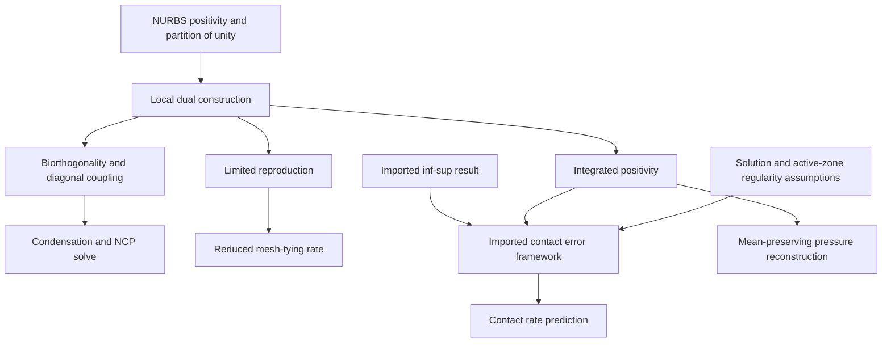

## 1. Paper identity and reading scope

**Seitz et al. (2016), Computer Methods in Applied Mechanics and Engineering 301, 259–280.** [DOI](https://doi.org/10.1016/j.cma.2015.12.018); [Zotero item](zotero://select/library/items/CNI9CR5C), personal library 3933681.

Read all 22 pages, Sections 1–6 and references, from **RK67WD7S**. Printed page = PDF page + 258. The other PDF attached to this item, **84QMZGJR**, concerns an isogeometric Reissner–Mindlin shell element and was **not** used as evidence for this review. It appears mismatched to the parent record. No library records were changed. Earlier sources supplying abstract convergence theory were not retrieved; their role is identified below.

## 2. Main contribution in plain language

The authors transfer an easily constructed **dual contact-force basis to NURBS-based isogeometric analysis**, retaining smooth geometry while allowing multiplier unknowns to be eliminated locally. Crucially, they also expose the limitation: this simple basis is stable and biorthogonal but cannot reproduce enough functions to preserve high-order convergence in smooth mesh-tying problems (Abstract; Section 4.1).

The paper’s central insight is that the same limitation can be acceptable in unilateral contact, where the physical solution is already less smooth and limits convergence. It also supplies a practical integration procedure and a pressure reconstruction that makes the computed multiplier coefficients easier to interpret physically.

## 3. Main results and their scope

**Structural result.** Elementwise dual basis construction gives biorthogonality and a diagonal slave coupling matrix (Eqs. (21)–(28)). This enables easy multiplier condensation and local control-point contact constraints. The paper claims first realization in these settings; priority was not independently investigated.

**Approximation result.** The constructed multiplier space guarantees partition of unity but only first-order global approximation in $L^2$, regardless of high local NURBS order (pp. 265–266). The associated displacement estimate is limited to about $O(h^{3/2})$ in the energy/$H^1$ norm for domain decomposition, instead of the $O(h^p)$ available with adequate equal-order standard mortar approximation for smooth solutions.

For unilateral contact, the authors invoke existing error-estimate theory and active-zone regularity assumptions to argue that $O(h^{3/2})$ is appropriate: the true solution is not smooth enough to realize arbitrary $p$-order gains under uniform refinement. This is **not a new complete proof of an $h^{3/2}$ estimate for arbitrary finite-deformation frictional contact**. Section 4.1 discusses the hypotheses; Section 5 tests selected cases. Fractional Sobolev regularity $u\in H^t$, $t<5/2$, is a statement about limited derivatives, not a guarantee of a stronger endpoint result without the other assumptions of the cited theory.

**Observed results.** Mesh tying recovers the predicted reduced rate, with an unexplained improved rate for one slave-side choice (Section 5.1). Hertz-type contact gives comparable approximately $h^{3/2}$ rates for standard and dual NURBS variants (Table 1). Higher-continuity NURBS give smoother global force histories in rotating frictional ironing (Figs. 17–18). Smoothness is not the same as pointwise accuracy, and higher continuity can smear the contact edge (p. 275).

## 4. Method and mathematical setup

NURBS represent geometry and displacement through the same nonnegative basis functions $R_a$. Unlike ordinary higher-order finite elements, their continuity across element boundaries can rise with degree. This smooth geometry helps when surfaces slide across element boundaries (Sections 1 and 3).

The multiplier basis $\Phi_a$ is constructed locally by a matrix transformation of the primal basis. In the notation of Eqs. (22)–(23),

$$\boldsymbol\Phi^e=A^e\mathbf R^e,\qquad
A^e=D^e(M^e)^{-1},$$

where $M^e_{jk}=\int_e R_jR_k\,de$ and $D^e_{jk}=\delta_{jk}\int_e R_k\,de$. These are **local construction matrices**, distinct from the assembled contact matrices using the same letters. Integrals are restricted to the portion with a feasible projection to the master surface. Nonnegativity of NURBS makes the diagonal integrals positive on nondegenerate overlap.

The resulting basis satisfies

$$\int_{\gamma_c^{(1)}}\Phi_aR_b\,d\gamma
=\delta_{ab}\int_{\gamma_c^{(1)}}R_b\,d\gamma.$$

That is biorthogonality, Eq. (21): each dual function couples to only its corresponding primal coefficient after integration. It does **not** say that $\Phi_a$ is nonnegative or continuous.

Normal contact uses an integrated gap $\widetilde g_j=\int\Phi_jg_{n,h}\,d\gamma$ and the complementarity residual

$$C_{n,j}=\lambda_{n,j}-\max(0,\lambda_{n,j}-c_n\widetilde g_j)=0$$

(Eqs. (29), (31), $c_n>0$). This is equivalent to nonnegative gap/nonnegative multiplier/complementarity at the discrete level. Tangential constraints have a Coulomb NCP analogue, Eq. (30). A semi-smooth Newton solve combines these with equilibrium; friction uses pseudo-time for its loading path even though inertia is omitted (Section 4.2).

For displayed pressure, the authors reconstruct using the **primal** NURBS basis and the solved dual coefficients, $\widetilde\lambda_h=\sum_aR_a\lambda_{a,\mathrm{dual}}$, Eq. (34). Eq. (35) preserves each element’s integrated traction. This post-processing must be distinguished from the actual discontinuous dual trial field.

## 5. Analysis: what the authors are trying to prove

The destination is to show that cheap dual-basis construction gives stable, usable contact coupling and to identify exactly how much approximation accuracy it sacrifices. The obstacle is that **stability, biorthogonality and approximation order are different properties**. No labelled lemmas or theorems are proved in a standalone sequence; the paper verifies some construction properties and invokes external abstract estimates.

| Result (paper label and locator) | Plain-language meaning | Assumptions and earlier results used | Why this step is needed | Where it is used next |
|---|---|---|---|---|
| NURBS properties, Section 3, pp. 263–264 | Geometry/displacements use nonnegative functions summing to one | Standard NURBS construction | Makes local dual mass construction feasible | Eqs. (22)–(24) |
| Biorthogonality (21), construction (22)–(23), p. 265 | Local matrix transformation produces integral duality | Nondegenerate integration domain and local mass inverse | Diagonal coupling and local elimination | (27)–(28), Section 4.2 |
| Partition of unity and inf–sup stability, p. 265 bullet list | Constants are reproducible; multiplier constraints do not become algebraically invisible | Imported proofs [21] and [51, Remark 2.11] | Supplies assumptions of the error framework | Estimate discussion pp. 265–266 |
| Positive mean (24) and pairing (25), pp. 265–266 | Required integrated positivity survives even if dual functions change sign | (21)–(23), nonnegative primal basis | Supports unilateral-contact estimate requirements | Imported framework [27] |
| Error-estimate application, p. 266 | With active-zone regularity, contact rate matches available solution regularity | Above properties plus external [27] and solution assumptions | Explains why reduced reproduction can be acceptable | Hertz convergence prediction |
| Approximation-order limitation, pp. 265–266 | Only constant reproduction is guaranteed globally | Elementwise construction | Explains why smooth mesh tying loses high-order rate | Section 5.1 |
| NCP functions (29)–(31), p. 267 | Translate weighted inequalities into Newton-compatible residuals | Dual local constraints; imported solver theory [52–53] | Solves the nonlinear contact states | All contact examples |
| Pressure reconstruction (34)–(35), p. 273 | Smooth/nonnegative visualization preserves mean traction | Solved coefficients; (24); convergence argument referred to [60] | Interprets dual multipliers without misleading raw oscillations | Figs. 10–15 |

Think of inf–sup stability as ensuring that a contact-force pattern cannot hide from all displacement tests. That prevents a kind of instability, but says nothing by itself about representing a smoothly varying exact force accurately. The simple dual basis passes the stability check while failing high-order reproduction. In smooth mesh tying this becomes the accuracy bottleneck; in contact, the solution’s edge regularity is already a bottleneck. Numerical studies then test those predictions. There is no guarantee that the extra smoothness cures every contact-edge singularity, nor that a smooth displayed pressure proves a more accurate variational solution.

## 6. Experiments and supporting evidence

**Two-patch plate with a circular hole (Section 5.1, Figs. 4–8).** Linear elasticity has an analytic reference, straight and curved patch interfaces, and a fixed 2:3 interface element-size ratio under knot refinement. Standard degree-$p$ mortar exhibits $h^p$ behavior; dual coarser-slave cases fall to $h^{3/2}$. Finer-slave cases exhibit $h^2$, which the authors suggest may be superconvergence but do not prove (p. 269). Comparisons by element size and by number of control variables differ; the authors also acknowledge increased matrix bandwidth (p. 271).

**Hertz-type contact (Section 5.2, Table 1, Figs. 9–15).** The actual problem is a hollow cylindrical geometry with nonlinear kinematics and displacement loading, so a finely refined NURBS solution is the reference, not the analytic Hertz pressure (p. 273). Table 1’s finest reported rates are roughly 1.46–1.59. Figures distinguish raw dual pressure from reconstructed pressure: reconstruction removes visible oscillations while preserving element means. At friction coefficient 0.75, coarse meshes still fail to resolve the sharp stick/slip kink. Higher degree/continuity can spread pressure over too wide a region (p. 275).

**Rotating ironing (Section 5.3, Figs. 16–18).** A curved indenter is pressed onto an elastic block for 10 steps, then slides while rotating 180 degrees over 60 steps; friction coefficient 0.1 and neo-Hookean material. Cubic NURBS produce the smoothest horizontal reaction history among the tested approximations. This supports reduced mesh-induced force oscillation, not a runtime superiority claim or a global solver-convergence theorem. Simulations use BACI; full linearization details are deferred (p. 267).

## 7. Reviewer’s reflections: value, strengths, and limitations

**Reviewer’s judgement.** The paper is unusually useful for understanding that a discretization can be stable yet suboptimal. It explicitly reports the mesh-tying limitation instead of presenting the contact success as universal. The paired examples make the role of solution regularity understandable (Sections 4.1, 5.1–5.2).

The pressure reconstruction is practically valuable, but the distinction between a smooth plot and the actual dual field must be kept visible. Preserving mean traction, Eq. (35), is a concrete conservation property; it is stronger evidence than cosmetic smoothness alone. Conversely, edge smearing and unresolved stick/slip transitions are author-observed costs of excessive continuity (p. 275).

The abstract/conclusion describe a positive-definite condensed system. **Reviewer caution grounded in scope:** the article does not prove positive definiteness of every finite-deformation frictional tangent. Removing a saddle-point multiplier block is not by itself a proof that arbitrary nonlinear/frictional linearizations are symmetric positive definite. Solver selection needs the actual problem and tangent properties; the missing full linearization prevents auditing that general claim from this paper alone.

The standard-mortar comparator also uses localized/lumped constraints rather than the fully coupled variational constraint system (Section 4.2 remark). Its pressure oscillations therefore should not be interpreted as an inherent defect of every standard mortar formulation. The authors themselves call their explanation a suspicion needing further study (p. 273).

I would reuse the local construction and mean-preserving reconstruction after reproducing the patch/contact tests. For high-order smooth patch coupling, I would investigate improved reproduction rather than assuming this simplest basis is sufficient.

## 8. Takeaways, questions, and connections

- Stability, diagonal coupling and high-order accuracy are independent requirements.
- A simple dual NURBS basis trades reproduction for locality and elimination.
- Contact regularity can make that tradeoff acceptable under uniform refinement.
- Reconstructed pressure must be identified separately from raw dual pressure.

Second-reading questions: Does your problem contain smooth tied interfaces or moving contact edges? Is error versus unknown count or full solve time the relevant metric? Do your displayed pressures preserve interface force? Does the actual tangent justify an SPD solver?

| Source | Relation | Target | Evidence locator | Status |
|---|---|---|---|---|
| This method | extends | Dual mortar framework summarized by Popp–Wall 2014 | Introduction, reference [29]; [review](Popp%20and%20Wall%20%282014%29%20-%20Dual%20mortar%20overview.md) | Explicit citation and method connection |
| Contact estimate discussion | uses | Wohlmuth et al. abstract quadratic-contact framework | Section 4.1, reference [27] | Imported theory, not re-proved |
| Local dual basis | limits | High-order mesh-tying convergence | Sections 4.1, 5.1 | Analytical discussion plus numerical evidence |
| Pressure post-processing | preserves | Element-integrated contact traction | Eqs. (34)–(35) | Explicit construction property |

[Back to the contact mechanics reading map](Contact%20Mechanics%20-%20Review%20Index.md)
