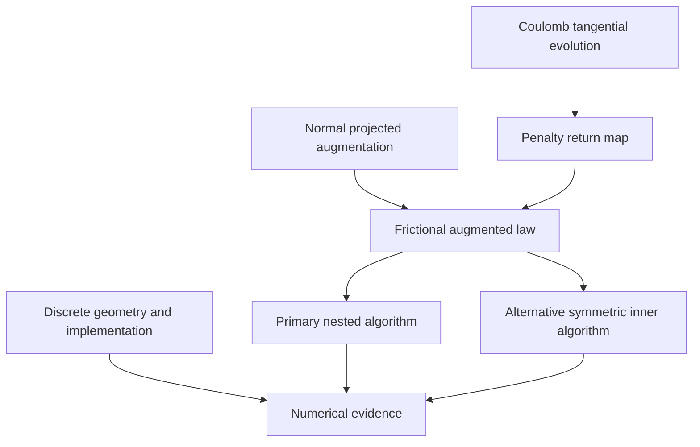

## 1. Paper identity and reading scope

Simo & Laursen (1992), *Computers & Structures* **42**(1), 97–116. [DOI](https://doi.org/10.1016/0045-7949(92)90540-G) · [Zotero item](zotero://select/library/items/8GW8GCMB) · [PDF](zotero://open-pdf/library/items/PKR2BWHB).

Read all 20 PDF pages: §§1–5, Appendices A–B and references. PDF page 1 is printed p. 97. Identity matches the library record. The return-map equations on printed p. 104 were inspected visually because OCR omitted parts. No citation key was supplied by the metadata. This is a source-grounded explanation, not independent proof or code verification.

## 2. Main contribution in plain language

**The paper extends augmented Lagrangian contact enforcement to Coulomb friction by augmenting both the normal contact constraint and the tangential no-artificial-slip constraint.** This lets a solver improve penetration and sticking errors through multiplier updates while keeping finite penalty stiffnesses (§3.3).

The key insight is to treat friction through an evolution law: actual tangential motion should equal the irreversible slip permitted by Coulomb friction. A penalty introduces an unwanted elastic tangential motion; augmentation progressively removes that numerical compliance. A primary return-mapping algorithm and an alternative with symmetric inner equations expose the tradeoff between enforcing the friction law during each solve and correcting it in the outer iteration (Tables 2–3).

## 3. Main results and their scope

**Derived algorithmic result.** Normal traction is a projected sum of a multiplier estimate and a penalty contribution. Tangential trial traction includes an increment of the tangential multiplier, followed by a Coulomb return map (Eqs. 3.16–3.21). At a converged multiplier fixed point, the unwanted penalty contribution vanishes in the relevant constrained directions; exact constraints do not require infinite penalty parameters. In computation “exact” means the prescribed constraint tolerance has been met.

**Local-solver statement.** With multipliers fixed in the inner solve and a consistent tangent, the authors retain asymptotically quadratic Newton convergence for that nonlinear solve (§2.3; p. 105). This is not a theorem that the outer augmentation always converges, nor a mesh convergence rate. Contact changes and nonsmooth transitions remain relevant to when the asymptotic regime applies.

**Numerical observations.** Augmentation corrects an intentionally underpenalized ring-upsetting solution (Figs. 10–12). For extrusion, the softer-penalty augmented run uses one-fifth the number of load steps of the reported penalty run, with four augmentations per step and similar load–displacement response (Fig. 14; p. 113). Fewer load steps are not a measured fivefold wall-time speedup.

**Conditions and limits.** The law uses one Coulomb coefficient, with no distinction between static and kinetic friction (§1). The central friction derivation is for a small-deformation rigid obstacle; finite-deformation examples and appendices show its implementation beyond that introductory setting. The paper supplies no general existence, uniqueness, finite-element error bound or global outer-iteration convergence proof for nonlinear frictional contact.

## 4. Method and mathematical setup

The paper uses a signed gap $g$ **positive for penetration**, normal compression $t_N\ge0$, tangential traction variable $\mathbf t_T$, and friction coefficient $\mu$. Its tangential traction convention is opposite to the actual tangential force on the body (Eq. 3.3). Do not transfer gap signs from other reviews without conversion.

Coulomb admissibility is

$$\Phi=\|\mathbf t_T\|-\mu t_N\le0.$$

Inside the friction bound the interface sticks; on the bound it may slip. “Nonassociated” here means that sliding is tangential only even though the threshold depends on normal pressure; differentiating the full friction function as a flow potential would introduce unwanted normal motion (Remark 3.3).

For fixed multiplier estimates,

$$t_N=\langle\lambda_N+\epsilon_N g\rangle_+,\qquad
\mathbf t_T^{\mathrm{trial}}=\mathbf t_{T,n}+\Delta\boldsymbol\lambda_T+\epsilon_T\Delta\mathbf u_T.$$

Here $\langle x\rangle_+=\max(x,0)$, $\epsilon_N,\epsilon_T$ are finite penalties, and $n$ denotes the previous converged time step. In the primary algorithm, the tangential trial traction is retained if admissible, otherwise returned radially to the disk of radius $\mu t_N$ (Eqs. 3.18–3.20). The tangential multiplier **increment** appears because the constraint concerns velocity/incremental slip, unlike the positional normal constraint (Remark 3.5).

Two nested loops have different jobs:

1. Hold multipliers fixed and solve equilibrium for displacements, using the contact law and a consistent Newton tangent.
2. Check penetration and sticking errors; update multipliers and repeat until the constraints are satisfied (Table 2).

The alternative algorithm holds a stick/slip partition and slipping tractions fixed during the inner solve, then repairs Coulomb admissibility during augmentation. This can yield symmetric inner equations but initially violates the correct friction state (Table 3; §4.1). Appendix A treats piecewise-linear closest-point geometry, including nonunique concave cases; Appendix B explains the nodal/master–slave FEAP realization.

## 5. Analysis: what the authors are trying to prove

The authors want to show how frictional constraint enforcement can inherit the practical advantages of augmentation without changing the displacement-based inner-system size. The obstacle is that Coulomb slip depends on the evolving normal traction and is an incremental, nonassociated law.

There are no numbered lemmas or theorems. The derivation and evidence chain is:

| Result (paper label and locator) | Plain-language meaning | Assumptions and earlier results used | Why this step is needed | Where it is used next |
|---|---|---|---|---|
| Eqs. 2.13–2.15; Remarks 2.6–2.8 | Projected multiplier updates improve normal contact with a fixed penalty | Signed gap and unilateral compression; established augmentation idea | Provides the normal-contact part and nesting pattern | Table 1; Eq. 3.16 |
| Eqs. 3.4 and 3.9 | Coulomb friction becomes a penalized evolution law | Small-deformation obstacle, one friction coefficient, tangential flow | Identifies the artificial elastic slip that must be removed | Backward-Euler return map |
| Eqs. 3.11–3.14 | A trial stick traction can be projected onto the friction bound | Penalized law and time increment | Gives a practical constitutive update | Augmented update in Eqs. 3.18–3.20 |
| Eqs. 3.17–3.21 | Augment the tangential evolution constraint and update its multiplier increment | Penalty/traction split; preceding return map | Transfers traction from artificial penalty deformation to multipliers | Primary algorithm, Table 2 |
| Table 2; Remarks 3.6–3.7 | Distinguish equilibrium convergence from contact-constraint satisfaction | Fixed multipliers in each solve; explicit gap/stick checks | Prevents a converged penalized equilibrium from being mistaken for exact contact | Numerical comparisons |
| Table 3; pp. 106–107 | Enforce Coulomb in the outer phase to symmetrize the inner phase | Frozen stick region and slipping traction | Alternative solver-cost tradeoff | Elastic-block comparison |
| Appendices A–B | Realize the geometry and incremental law on discrete contacting bodies | Closest-point search, nodal contact, prior implementation framework | Connects the conceptual algorithm to FEAP examples | §4 |

Intuitively, a penalty spring initially carries contact force by allowing small forbidden motion. Augmentation records that force in a multiplier. The next equilibrium solve can therefore carry it with less forbidden motion. The tangential case needs a return map so the stored force does not exceed the pressure-dependent friction bound. This establishes the algorithm's construction and fixed-point interpretation; it does not establish global convergence for every nonlinear problem.

## 6. Experiments and supporting evidence

**Elastic block, §4.1, Figs. 4–8.** A 200-element linear-elastic block ($E=1000$, $\nu=0.3$, $\mu=0.5$, in the benchmark's units) is pressed against and drawn across a rigid foundation. The primary method barely changes traction but corrects the small tangential motion in the stick region after one augmentation; the last five nodes slip in the reported converged result. The alternative reaches the reported result after four augmentations. With fixed contact area and linear elasticity, its inner problem is linear, explaining its appeal here. End-node friction is disabled to match the comparison setup, so this is a specific benchmark convention rather than a universal boundary treatment (pp. 108–110).

**Ring upsetting, §4.2, Figs. 9–12.** Axisymmetric finite-strain elastoplastic deformation with $\mu=0.4$ compares nominal penalties with intentionally softer penalties and one or two augmentations per load step. Load and contact-reaction curves approach the nominal calculation. The authors use fixed augmentation counts rather than the full tolerance-based stopping rule (p. 111); thus these runs demonstrate practical correction, not that every stated constraint tolerance was certified.

**Aluminum extrusion, §4.3, Figs. 13–14.** An 80-element billet, radius 5.08 cm and length 25.4 cm, is displaced 17.78 cm into a 5° conical die with $\mu=0.1$. The baseline requires 140 load steps after penalty tuning; the augmented softer-penalty run uses 28 and four augmentations each. Similar force curves support robustness for this challenging simulation. The paper does not provide a comparable wall-time/hardware performance study.

## 7. Reviewer’s reflections: value, strengths, and limitations

**Reviewer’s judgement.** This is a useful paper for understanding the difference between “equilibrium solved” and “constraints satisfied.” Its tangible contribution is the incremental tangential augmentation, not just adding a normal multiplier.

The primary/alternative comparison is a strength because it exposes a real design choice: symmetric linear algebra may require more outer corrections. The intentionally underpenalized tests directly exercise the claimed benefit instead of only presenting a successful tuned run (§4).

The principal limitation for a reader seeking analysis is that the paper constructs and tests algorithms rather than proving global convergence. Claims about improved conditioning should be read relative to avoiding excessively large penalties; the full nonlinear problem can still be difficult. A further practical issue is stopping: the ring tests' fixed counts are convenient demonstrations, but production use should measure constraint residuals (Table 2 versus p. 111).

Learn the two-loop logic, the distinction between normal position and tangential evolution constraints, and why friction produces a nonsymmetric consistent tangent. Do not equate the extrusion step-count reduction with an established general speedup.

## 8. Takeaways, questions, and connections

- Augmentation moves force support from penalty deformation into multiplier estimates.
- Tangential augmentation concerns a slip/evolution constraint and naturally uses multiplier increments.
- Newton convergence and augmentation convergence are separate questions.
- Symmetric inner equations can trade direct friction enforcement for outer iterations.

Second reading: Which residual will certify sticking in your units? What happens when a contact point opens during augmentation? When would fewer expensive nonsymmetric solves beat more symmetric solves?

| Source | Relation | Target | Evidence locator | Status |
|---|---|---|---|---|
| This paper | uses | Coulomb return mapping | §§3.2–3.3 | Explicit |
| This paper | extends | Normal augmented constraint treatment to tangential evolution | Eqs. 3.16–3.21 | Explicit |
| This paper | compares-with | Pure penalty enforcement | Figs. 5–6, 10–14 | Explicit |
| This paper | connects-to | [Laursen and Simo (1993) - Large deformation frictional contact](Laursen%20and%20Simo%20%281993%29%20-%20Large%20deformation%20frictional%20contact.md) continuum finite-deformation contact geometry | Appendices A–B versus the later paper's geometric formulation | Reviewer conceptual connection |

[Back to the contact mechanics reading map](Contact%20Mechanics%20-%20Review%20Index.md)
