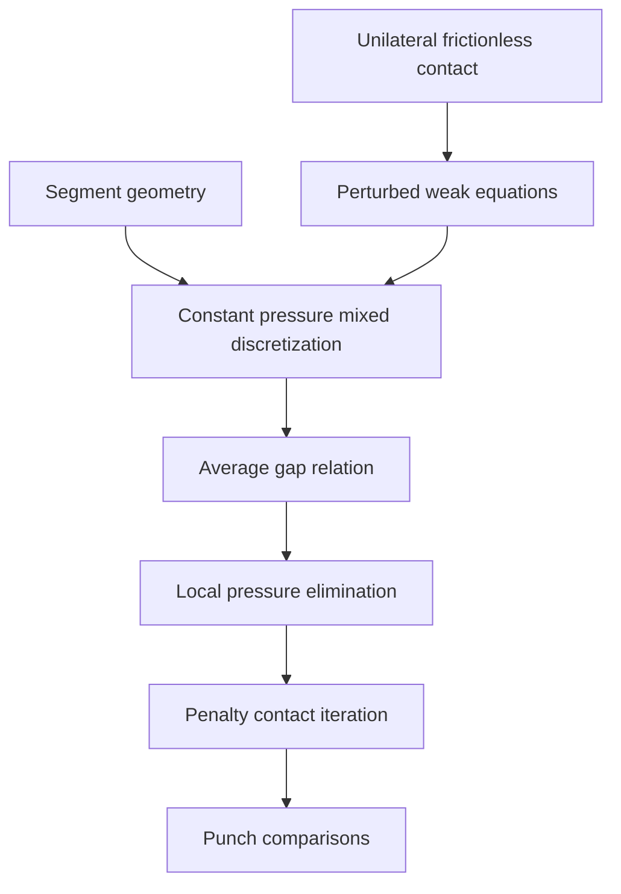

## 1. Paper identity and reading scope

Simo, Wriggers & Taylor (1985), *Computer Methods in Applied Mechanics and Engineering* **50**, 163–180. [DOI](https://doi.org/10.1016/0045-7825(85)90088-X) · [Zotero item](zotero://select/library/items/X4RWJZK4) · [PDF](zotero://open-pdf/library/items/MMCDPURK).

Read all 18 PDF pages, including §§1–6, tables and references. PDF page 1 corresponds to printed p. 163. The title and authors match the library record. OCR is imperfect; Table 4 was checked against the rendered page. This review explains the derivations and evidence, not an independent correctness proof. No external papers were retrieved.

## 2. Main contribution in plain language

**The central contribution is to enforce contact through an average gap over a contact segment, derived from an independently approximated contact pressure.** This gives a principled alternative to deciding contact separately at mesh nodes when the two surface meshes do not line up. The pressure is constant on each segment; its elimination produces a displacement-only penalty system (§§2–4).

The distinction is the discretization of the constraint, not simply the use of a penalty. An intermediate surface and contact segments allow both bodies to contribute to the interface geometry instead of selecting one surface as the master by default (§3.1). The authors present this with finite-deformation applications in mind, but the actual development here uses linearized kinematics and frictionless contact (§2; §6).

## 3. Main results and their scope

**Derived result.** A piecewise-constant pressure approximation converts the weak contact equation into a relation between segment pressure and average gap. With the paper's compressive-negative multiplier convention,

$$\lambda_s=\epsilon\bar g_s,\qquad \bar g_s\approx\tfrac12(g_1+g_2),$$

on an active segment; $\epsilon>0$ is the penalty parameter and $g_1,g_2$ are endpoint gaps (Eqs. 3.14–3.17). Contact activation must still enforce the unilateral condition; this formula is not an attractive force law across an open gap.

**Algebraic result.** Eliminating segment pressures yields the penalty-like residual and tangent in Eq. 4.3 and Table 3. Its contact operator differs from a nodal penalty operator because it represents averaged gaps. This is an exact elimination of the chosen discrete mixed equations, not proof that their solution equals the exact continuum contact solution.

**Numerical result.** In the rigid-punch comparison, the proposed method gives the closest displacement agreement with the node-to-node comparison solution. In the 88-foundation-element row of Table 4 (p. 179), the reported displacement is $1.162\times10^{-2}$ versus $1.167\times10^{-2}$ for the node-to-node case; one-pass and two-pass values are $1.256\times10^{-2}$ and $1.101\times10^{-2}$. These are the table's problem-unit displacements, not universal errors or rates.

**Scope limits.** No new finite-element convergence-rate, inf–sup stability, existence or uniqueness theorem is supplied. The weak convergence expectation as $\epsilon\to\infty$ is referred to external linear-problem literature (§2.2). Increasing $\epsilon$ still worsens conditioning (§4). Average nonpenetration does not ensure pointwise nonpenetration at every location on a coarse segment.

## 4. Method and mathematical setup

Two bodies have displacement fields $u^1,u^2$. The gap $g$ is positive when separated, and the contact multiplier $\lambda$ is negative in compression. The physical frictionless conditions are

$$g\ge0,\qquad\lambda\le0,\qquad g\lambda=0.$$

The last equation says pressure and separation cannot coexist (Eq. 2.5). With elastic body potential $\Pi$, the perturbed functional is, in compact notation matching Eq. 2.8,

$$\mathcal L_\epsilon(u,\lambda)=\Pi(u)+\int_{\Gamma_c}\lambda g(u)\,da-\frac1{2\epsilon}\int_{\Gamma_c}\lambda^2\,da.$$

The multiplier variation gives a **weak** relation $g-\lambda/\epsilon=0$ over the active interface. “Weak” means tested through integrals rather than imposed separately at every point. Restricting the multiplier to constants on each segment makes that relation an average. Thus the shape chosen for the pressure determines which information about the gap the discretization can enforce (§3.3).

The implementation uses four-node isoparametric body elements, discontinuous constant segment pressures, and trapezoidal integration. Opposite-edge projections define the segment geometry (Fig. 2; Table 1). The intermediate-surface parameter $\beta$ remains a geometric choice informed by relative stiffness; the method does not eliminate every interface choice (§3.2). Pressure variables can then be eliminated locally. A contact iteration updates displacements and active contact segments (Table 3). Static condensation and rank-one updates are optional accelerations, most attractive when contact unknowns are a small fraction of the system (Remarks 4.2–4.3).

## 5. Analysis: what the authors are trying to prove

The authors want to establish that a mixed variational description produces a practical, coherent contact discretization for nonaligned meshes. The obstacle is that nodewise gap enforcement does not naturally define a pressure field or an unbiased interface for two deformable surfaces.

There is **no lemma-to-theorem chain** in this formulation paper. Its actual derivation dependencies are:

| Result (paper label and locator) | Plain-language meaning | Assumptions and earlier results used | Why this step is needed | Where it is used next |
|---|---|---|---|---|
| Eq. 2.5 | Bodies separate or carry compression, but do not carry tensile contact | Linearized frictionless gap geometry | Defines the physical constraint | Perturbed variational setup and active-contact decisions |
| Eqs. 2.8–2.11 | Equilibrium and a regularized constraint become coupled weak equations | Elastic potential and multiplier regularization | Supplies equations for both displacement and pressure | Mixed approximation in §3.3 |
| Eqs. 3.2–3.11; Figs. 1–2 | A segment and an intermediate surface can be constructed without matching nodes | Straight element edges and selected intermediate geometry | Gives a place to integrate the contact equations | Eqs. 3.12–3.16 |
| Eqs. 3.14–3.17 | Constant pressure makes average gap the controlling quantity | Mixed equations, constant segment pressure, trapezoidal quadrature for the final formula | Explains why this is different from nodal penalty | Discrete residual in Eq. 3.18 |
| Eqs. 4.1–4.3; Table 3 | Remove pressure unknowns and solve a penalty-like system | Discrete mixed equations and chosen active segments | Makes the formulation implementable with displacement solvers | Numerical examples |
| Remarks 4.2–4.3 | Condensation and rank-one updates can reduce repeated algebra | Small contact subset; invertibility for inverse updates | Optional computational branch | Not needed for the mathematical definition of the method |

In plain language: first decide what contact means physically; then write work and gap constraints in integral form; then choose a pressure field simple enough to store per segment. That choice automatically averages the gap. Finally eliminate the pressure and test the resulting algorithm. Without the constant-pressure step, the characteristic average-gap relation would not follow. The examples then assess the choice empirically; they do not complete a missing convergence proof.

## 6. Experiments and supporting evidence

**Rigid punch, §5.1, Figs. 3–5 and Table 4.** Nonaligned surface nodes isolate the issue the method was designed to address. One-pass and symmetric two-pass nodal penalties are compared against the proposed method, followed by mesh refinement. The coarse profiles visibly differ: average enforcement permits an intermediate penetration profile rather than eliminating all local penetration (p. 176). Table 4 supports improved displacement agreement for this benchmark, not uniformly superior pressure accuracy across geometries.

**Flexible punch on an elastoplastic foundation, §5.2, Figs. 6–8.** A 120-bilinear-element mesh tests two deformable bodies and nonlinear material response. Comparing elastic and elastoplastic calculations shows reduced vertical stress beneath the punch after plasticity and a plotted plastic region. The authors explicitly state that the mesh is too coarse for accurate stress resolution, especially at the interface (p. 179). This example demonstrates feasibility and plausible response; there is no closed-form reference solution.

## 7. Reviewer’s reflections: value, strengths, and limitations

**Reviewer’s judgement.** This is worth reading to understand why an interface approximation is a modelling/discretization decision, not merely a contact-search implementation detail. The derivation from pressure space to average constraint is particularly clear and reusable (§3.3).

A strength is the targeted comparison against one-pass and two-pass penalties: it directly tests nonaligned contact rather than only showcasing a complicated simulation. Another is the explicit pressure elimination, which connects mixed and penalty viewpoints (§4).

An author-acknowledged limitation is the restriction to linear kinematics here, despite the intended relevance to finite deformation (§6). Another is coarse stress resolution in the elastoplastic test. A reviewer-inferred practical limitation is that an averaged constraint can hide opposite-signed local gaps; the coarse profiles themselves show why pointwise penetration must be checked if an application requires it. The method also retains the penalty accuracy/conditioning tradeoff; the perturbed formulation should not be read as having solved that problem (§4).

For implementation today, learn the **pressure-space → weak constraint → elimination** logic first. Reusing the precise geometric construction would require validation for the intended mesh, motion and contact law; this paper does not justify frictional or arbitrary finite-deformation use by itself.

## 8. Takeaways, questions, and connections

- Constant segment pressure means the solver sees an average gap.
- A mixed formulation can produce a displacement-only penalty implementation.
- Better displacement agreement on a punch benchmark is not a general convergence theorem.
- Local penetration and conditioning remain meaningful diagnostics.

Second reading: How would a linear pressure space change the constraint moments? How sensitive is the interface result to $\beta$? What additional geometric derivatives would finite deformation require?

| Source | Relation | Target | Evidence locator | Status |
|---|---|---|---|---|
| This paper | discretizes | Frictionless unilateral contact | §§2–3 | Explicit |
| Constant segment pressure | uses | Average gap enforcement | Eqs. 3.14–3.17 | Derived in paper |
| This paper | compares-with | One-pass and two-pass nodal penalties | §5.1; Table 4 | Explicit |
| This paper | connects-to | [Simo and Laursen (1992) - Augmented Lagrangian friction](Simo%20and%20Laursen%20%281992%29%20-%20Augmented%20Lagrangian%20friction.md) augmented Lagrangian friction treatment | §4 and §6 mention augmented procedures; the other review treats friction | Reviewer conceptual connection, not a claimed direct extension |

[Back to the contact mechanics reading map](Contact%20Mechanics%20-%20Review%20Index.md)
